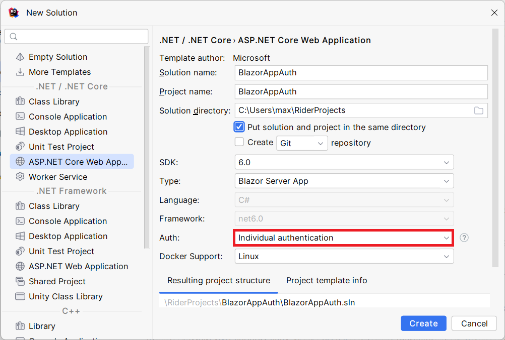

# Authentication

Aktuell können die ToDos von jedem
eingesehen und bearbeitet werden. Für
eine moderne Webanwendungen ist das 
noch nicht ganz ideal. 

Zum Glück kann man bei ASP.NET Core 
ganz einfach eine Authentication
hinzufügen. Erstelle dafür ein neues
Projekt und achte darauf das beim Punkt
Auth **Individual Authentication** 
ausgewählt ist.



Startet man nun das neu angelegte Projekt 
ist der selbe Beispielcode drinnen wie
sonst auch. Nur diesmal sind einige
Dateien extra dabei die sich kümmern um:
- Das Speichern von neuen Benutzern
  in einer SqLite Datenbank
- Verschlüsselung der Passwörter
- Versenden von Bestätigungsmails
- etc.

Für das versenden von Bestätigungsmails
muss man einen Server angeben an den
die C#-Anwendung SMTP-Pakete schicken 
kann. Da wir so einen Server nicht haben
ist es auch ok wenn wir die notwendigkeit
einer Bestätigungsmail kurzerhand ausschalten. 

Gehe dazu in die Hauptdatei `Program.cs` 
und setze den Wert `RequireConfirmedAccount` auf `false`.

```csharp
builder.Services.AddDefaultIdentity<IdentityUser>(options => options.SignIn.RequireConfirmedAccount = false)
    .AddEntityFrameworkStores<ApplicationDbContext>();
```

Nun sollte es möglich sein dass du dich
auf deiner eigenen Anwendung registrieren
und danach einloggen kannst. Dokumentiere
diese Funktion in deinem Protokoll. 

## ToDo Integration

Kopiere alle Dateien die du brauchst um
ToDos in einer CSV zu speichern aus 
deinem alten Projekt in das neue.

Es soll nun möglich sein dass die ToDo-Seite 
nur aufgerufen werden kann wenn man
eingeloggt ist. Ist man nicht eingeloggt
und möchte die Seite aufrufen soll man
auf die Login-Seite weitergeleitet werden.

Schau dir dazu den Code in `Shared/LoginDisplay.razor` an.
Mit dem `<AuthroizeView>`-Element kann man den Login-Status prüfen.

Es soll möglich sein dass mehrere User
ToDo-Einträge anlegen. Jeder User soll 
nur seine eigenen Einträge sehen. Erweitere
dafür die Klasse `ToDoItem.cs` um eine
Klassenvariable in der der Besitzer des
Items gespeichert wird. Beim Laden der
Einträge aus der CSV soll eine gefilterte
Liste zurück gegeben werden in der nicht
alle Einträge vorhanden sind sondern nur
die des aktuellen angemeldeten Benutzers. 

Ob du die Einträge alle in eine Datei speicherst
und beim Aufruf filterst oder du je Benutzer
eine eigene Datei anlegst - oder ganz 
anders - kannst du selbst planen. 
Beides ist in Ordnung. 

