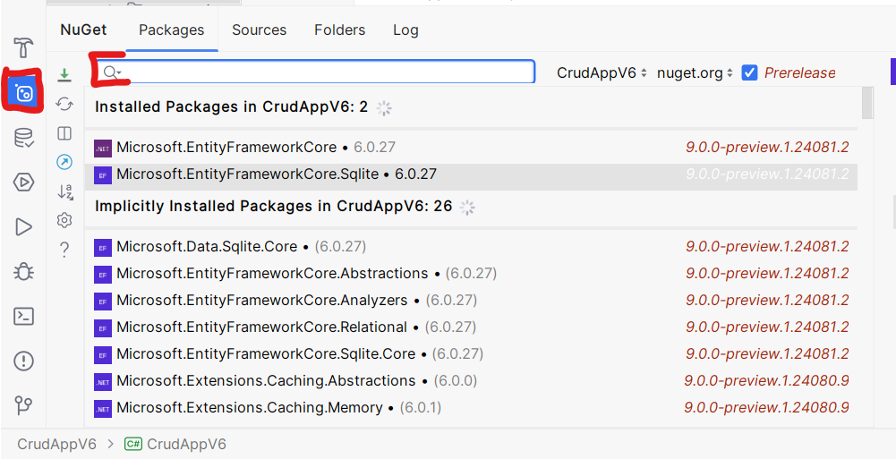

# Datenbankanbindung an ASP

Link zu Beispielprojekt: [github.com](https://github.com/maximiliankraft/minimal-ef-example)

## Einführung Datenbanken

Um verschiedene Arten von Daten zu speichern könnte man mehrere
CSV-Dateien verwenden. Jedoch ist es in diesem Ansatz schwer
effizient mit den Daten umzugehen. Man kann eigentlich nur alle
Daten auf einmal anzeigen. Möchte man die Daten filtern muss man
die komplette Datei in den RAM laden (teilweise laden gänge auch,
wäre aber noch umständlicher). Dann jedes Element in einer for(each)-Schleife
durchgehen und prüfen ob die Bedingung erfüllt ist. 

**Datenbanken** nehmen einem diese Arbeit zu einem großen Teil ab.
Man kann Abfragen schreiben in denen man spezifiziert welche Art
von Daten man haben möchte und die Datenbank erledigt das Filtern
von selbst. Kurz erklärt wie diese Optimierungen funktionieren:

Stell dir vor wir haben folgende Klasse:

```csharp
class Person{
    int Id;
    string FirstName;
    string LastName;
}
```

Aus einer CSV-Datei wurden Instanzen dieser Klasse gelesen und in der Liste

```csharp
List<Person> people;
```
gespeichert. Möchte man nun eine Liste haben in der - gefiltert - alle 
Personen stehen die den Vornamen Peter haben kann man so vorgehen:

```csharp

List<Person> filtered = new List<Person>();

foreach(var person: people){
    if(person.FirstName == "Peter"){
        filtered.Add(person);
    }
}
```

Bei ein paar tausend Datensätzen dauert das nicht all zu lange auf modernen
Prozessoren. Jedoch stößt man mit diesem einfachen Ansatz an seine Grenzen 
wenn man mehrere Millionen oder noch mehr Datensätze verarbeitet. Die Suche 
- muss jedes mal neu ausgeführt werden
- ist nicht parallel

Datenbanken bauen sich intern Strukturen auf um beim Einfügen der Daten
später schneller zu wissen wo diese liegen. Ähnlich wie ein Inhaltsverzeichnis 
in einem Buch. Solche Strukturen nennt man B-Trees bzw. balanced Trees. 
Deren genaue Arbeitsweise ist für die Erfüllung dieser Aufgabe nicht 
relevant, falls es dich aber interessiert kannst du hier mehr darüber
lesen: [Introduction of B-Tree](https://www.geeksforgeeks.org/introduction-of-b-tree-2/). 

## Vorbereitung

Um mit Datenbanken in ASP.NET Core arbeiten zu können benötigt man 
zusätzliche Bibliotheken die in der Standard-Installation nicht dabei sind.

Diese kann man über den NuGet-Paketmanager installieren. Dazu muss man in 
Rider in der Sidebar zunächst in die NuGet-Sektion gehen. In dem
Suchfeld dann bitte nach folgenden Paketen suchen:
- Microsoft.EntityFrameworkCore
- Microsoft.EntityFrameworkCore.Sqlite

Funktioniert in Visual Studio ähnlich, siehe folgende [Anleitung](https://learn.microsoft.com/de-de/nuget/consume-packages/install-use-packages-visual-studio)



Damit wird zunächst das Entity Framework installiert. Achte auf eine für dich kompatible Version. Wenn du das .NET Core SDK 8 nimmst muss die EF (Entity Framework) Major Version ebenfalls 8 sein. In meinem Fall in dem Screenshot habe ich für alles Version 6 genommen, die rennt stabiler in Rider. EF ist eine 
Bibliothek welche ein einheitliches Interface bietet zum Zugriff
auf verschiedene Datenbanken. Das Paket `Microsoft.EntityFrameworkCore.Sqlite` beinhaltet Treiber damit EF weis wie 
es mit SQLite-Datenbanken umgehen kann. Es gibt auch Treiber für
MySQL, MSSQL uvm. 

## Integration

Lege eine neue Klasse an die von `DbContext` erbt. Darin kannst 
du den Pfad angeben an dem die Datenbank-Datei gespeichert wird.
Bei anderen Datenbanken muss man dort die URL zum Server angeben, 
Username, Passwort etc. 

Zudem muss man durch überschreiben der Methode `OnConfiguring` 
festlegen was passiert wenn der Datenbank-Kontext konfiguriert 
wird. Das noch leere übergebene `options`-Objekt muss man 
konfigurieren. Durch Aufruf der `UseSQlite`-Methode mit einem 
Connection-String gibt man dem SQLite-Treiber alle Informationen
die er benötigt um eine Datenbank anzulegen. 

Die `DbSet<T>`-Variablen muss man für jede Klasse anlegen die
in der Datenbank gespeichert werden soll. In deinem Fall dann
die Klasse `ToDoItem`. Hier habe ich den Beispielcode mit den 
WeatherForecasts erweitert dass diese in der Datenbank gespeichert
werden können. 

```csharp
public class DataContext : DbContext
{
    private static string _dbPath = "data.db";

    // The following configures EF to create a Sqlite database file
    protected override void OnConfiguring(DbContextOptionsBuilder options)
    {
        options.UseSqlite($"Data Source={_dbPath}");
    }

    
    // A DbSet is a collection that can store and retrieve data
    // from the Database
    public DbSet<WeatherForecast> WeatherForecasts { get; set; }
    
}
```

Im `WeatherForecastService` kann man dann folgendermaßen Daten 
aus der Datenbank lesen und schreiben:

```csharp

    // ctor (kurzform für Konstruktor)
    public WeatherForecastService()
    {
        // Neuen Datenbankkontext anlegen
        db = new DataContext();

        // Sicherstellen dass die Datei erstellt wurde
        db.Database.EnsureCreated();
    }

    public Task<WeatherForecast[]> GetForecastAsync(DateTime startDate)
    {
        // generiere zufällige daten
        var weatherData = Enumerable.Range(1, 5).Select(index => new WeatherForecast
        {
            Date = startDate.AddDays(index),
            TemperatureC = Random.Shared.Next(-20, 55),
            Summary = Summaries[Random.Shared.Next(Summaries.Length)]
        });

        // füge mehrere Elemente auf einmal in die Datenbank ein
        db.WeatherForecasts.AddRange(weatherData);

        // Schreibe alle zwischengespeicherten Daten 
        // in die Datenbank
        db.SaveChanges();

        
        
        // hole alle Daten aus der Datenbank und konvertiere
        // das Ergebnis in ein Array
        return Task.FromResult(db.WeatherForecasts.ToArray());
    }
```

## Aufgabenstellung

- Installieren der NuGet-Pakete (wenn nicht bereits installiert)
- Datenbank-Kontext erstellen
- Daten in Datenbank schreiben
- Daten aus Datenbank lesen
- Daten nach Benutzer filtern

> Beispiel wie man im WeatherForecast filtern kann nach positiven Temperaturen: 
```csharp
db.WeatherForecasts.Select(forecast => forecast.TemperatureC > 0);
```
