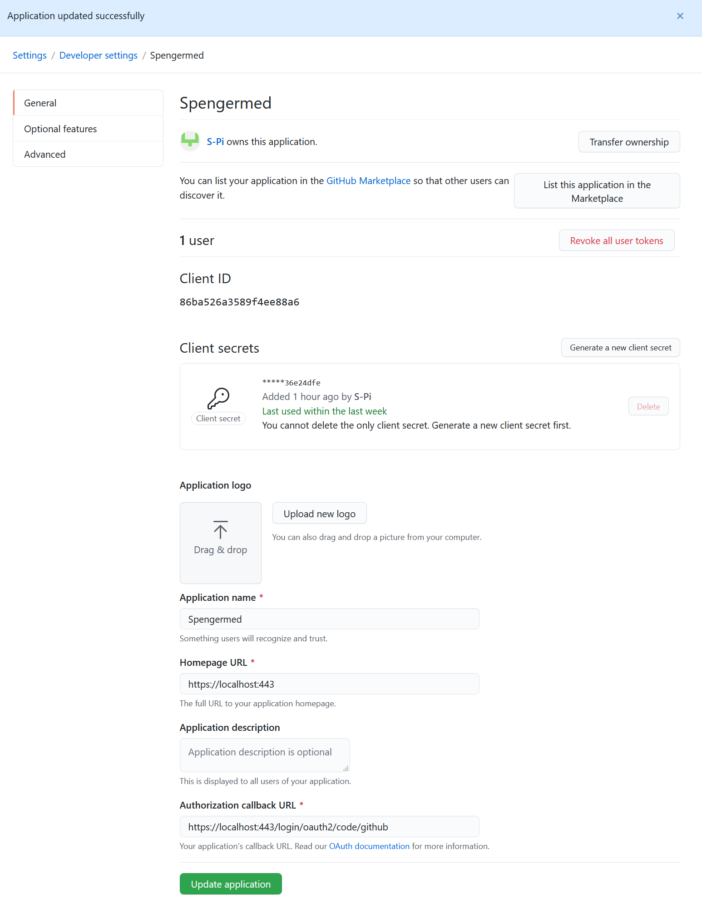

# Spring OIDC & OAuth

## https - eine Verschlüsselte Verbindung zum Server einrichten
Für https brauchen wir Zertifikate. Diese können wir während der Entwicklung selbst erstellen über das java keytool. 
   Wenn die Webseite veröffentlicht wird, brauchen wir auch ein vertrauenswürdiges Zertifikat von einer Certificate 
   Authority (CA). LetsEncrypt würde sich hier z.B anbieten. 
Wir werden zunächst ein eigenes Zertifikat erstellen. Es gibt dazu Anleitung [hier](https://www.baeldung.com/spring-boot-https-self-signed-certificate). 
Beachte folgendes:

- Der Alias ist statt "baeldung" =>  "spengermed" zu nennen.
- Nur bis inkl. Kapitel 3 umsetzen, Kapitel 4 brauchen wir nicht.
- Die Dependencies von hier unten nehmen, nicht spring boot security.
- die Keystore Dateien musst du noch unter ~ resources/keystore/spengermed.p12 ~ kopieren.


Teste es danach unter: https://localhost:443/api/`<deine-ressource>`
Achtung - die selbst zertifizierten Zertifikate sind für Browser nicht vertrauenswürdig. Entweder die Zertifikate in den Browser laden, oder das angezeigte Sicherheitsrisiko akzaptieren.

## Authentication mit OAuth

Als nächstes wollen wir eine ganz einfache Login-Funktion mit GitHub einrichten.
Dazu benötigst du zuerst einen GitHub Account.
Wir orientieren uns an folgender Anleitung: https://spring.io/guides/tutorials/spring-boot-oauth2/
Wobei wir nicht alles ausführen müssen und die wichtigsten Punkte hier zusammengefasst sind.
Wer die Applikation weiter ausbauen möchte, kann jedoch die Anleitung weiter umsetzen.

Authentication ist der Nachweis, dass der Benutzer auch berechtigt ist, auf die Daten zuzugreifen.
Mit OAuth2.0 können wir Benutzerkonten von bereits existierenden Seiten Wie GitHub, Google usw. verwenden oder unseren eigenen Authentifizierungs-Server einrichten.

Wir verwenden hier den Server von GitHub, wobei auch andere leicht eingebunden werden können.

## Erweiterung der pom.xml

```xml
<dependency>
    <groupId>org.springframework.boot</groupId>
    <artifactId>spring-boot-starter-oauth2-client</artifactId>
</dependency>
<dependency>
    <groupId>org.webjars</groupId>
    <artifactId>jquery</artifactId>
    <version>3.4.1</version>
</dependency>
<dependency>
    <groupId>org.webjars</groupId>
    <artifactId>bootstrap</artifactId>
    <version>4.3.1</version>
</dependency>
<dependency>
    <groupId>org.webjars</groupId>
    <artifactId>webjars-locator-core</artifactId>
</dependency>

```

## Registrieren der App unter https://github.com/settings/developers
Und eintragen der Daten, wobei die Client ID und das Secret natürlich unterschiedlich sein müssen.



## Ergänzung der application.properties

````properties
#start oauth2
spring.security.oauth2.client.registration.github.clientId: <Eigene Client ID hier einfügen>
spring.security.oauth2.client.registration.github.clientSecret: <Eigenes Secret hier einfügen>
#end oauth2
````

5. Applikation aufrufen mit https://localhost:443
Nach dem Login kannst du auf :https://localhost:443/api/`<deine-ressource>` zugreifen. Davor sollte das nicht möglich sein. Füge auch einen Endpunkt https://localhost:443/user/name hinzu welcher deinen Github-Usernamen ausgibt mit dem du dich via OAuth2 authentifiziert hast. Nachdem die FilterChain den Zugriff auf alle Ressourcen ohne OAuth blockieren sollte. 

Diese könnten z.B so aussehen: 

```java
    @Bean
    public SecurityFilterChain oauthFilterChain(HttpSecurity http) throws Exception {
        http
            .authorizeRequests()
                .antMatchers("/oauth/**", "/user/**", "/<deine-ressource>/**")
                .authenticated()
            .and()
                .oauth2Login()
                .userInfoEndpoint()
            .oidcUserService(oidcUserService());

        return http.build();
    }
```

Du kannst ein privates/inkognito Fenster öffnen, um den Login erneut zu testen oder die Cookies löschen.

