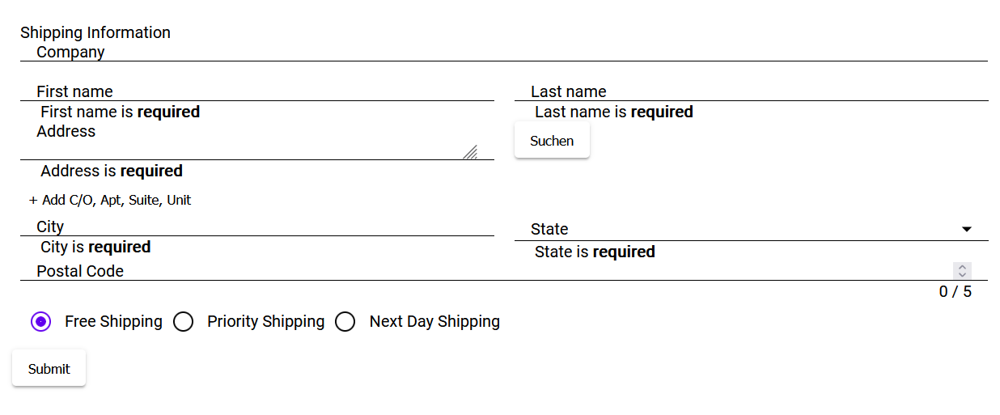

# Angular Adressformular

## Angular Material

Um nicht selbst ein Formular von Grund auf bauen und stylen zu müssen eignet sich *Angular Material*. Zum einen gibt es dort vorgefertigte Komponenten welche schön aussehen. Zudem gibt es auch sogenannte *Schematics* welche Vorlagen für ganze Komponenten sind. *Angular Material* bietet dafür die Schematics Table und AddressForm an. 

Erstelle ein neues Angular-Projekt:

Füge Material als Dependency in deinem Projekt hinzu:

> Erste Schritte mit Angular Material: [hier](https://material.angular.io/guide/getting-started)

Erstelle einen AddressForm Komponenten aus einer Schematic:

> Beispiel wie man eine Tabellen-Komponente aus einem Schema erstellt: [hier](https://angular.io/guide/schematics#generation-schematics)

> Beispiel wie man eine AdressForm-Komponente aus einem Schema erstellt: [hier](https://material.angular.io/guide/schematics#address-form-schematic)

Die fertige Schematic-Komponente sieht dann ungefähr so aus:

## Adressservice der Stadt Wien

Auf [data.gv.at](https://www.data.gv.at/katalog/dataset/c223b93a-2634-4f06-ac73-8709b9e16888) stellt die Stadt Wien eine API zur Verfügung welche es ermöglicht weitere Infos zu einer Adresse zu bekommen. Damit ist es möglich Autovervollständigungen für alle Adressen in Wien vorzuschlagen. Hier die [API_URL](http://data.wien.gv.at/daten/OGDAddressService.svc/GetAddressInfo?Address=). 

Um diese API nutzen zu können bietet sich ein Service an. Beachte dass Angular bei der Erstellung eines Services das Wort `Service` als Postfix anhängt. 

> Anleitung zum Services erstellen [hier](https://angular.io/tutorial/tour-of-heroes/toh-pt4)

Der Service braucht auch Zugriff auf das HTTP-Modul, um mit der API kommunizieren zu können. 

> Anleitung zur Kommunikation via HTTPModule [hier](https://angular.io/guide/http)

Schreibe nun im AddressService eine Funktion welche eine Adresse an die API von Wien schickt und das Ergebnis davon asynchron retourniert. Das Ergebnis - ein JSON-String - sollte dann noch in einen Typ umgewandelt werden. Man kann mit [json2ts](http://json2ts.com/) aus einem JSON-String sich Typescript-Interfaces generieren lassen. 

Füge im Adressformular einen Button hinzu (wie im obigen Screenshot) welcher die Daten die sich in der Adresszeile befinden an den Adressservice schickt. Wenn sinnvolle Daten zurückkommen sollen diese in die restlichen Felder wie PLZ, Ort etc. eingefügt werden. 

## Alternativer Adressservice

Das Land Oberösterreich betreibt mit *Doris* einen Service der Österreichweit Adressen findet: [hier](https://www.geoland.at/site/geoservices.html)

 
## Test- & Bewertungsgrundlagen

- Angular Material verwendet (30%)

- Eigenen Service verwendet (10%)

- Response typisiert und auf Validität überprüft (10%)

- Eingabe einer beliebigen Wiener Adresse, die restlichen Daten wie Bezirk, PLZ etc. sollen dann ausgefüllt werden. (50%)

- Zusatzaufgabe: Doris API verwendet (+10%)