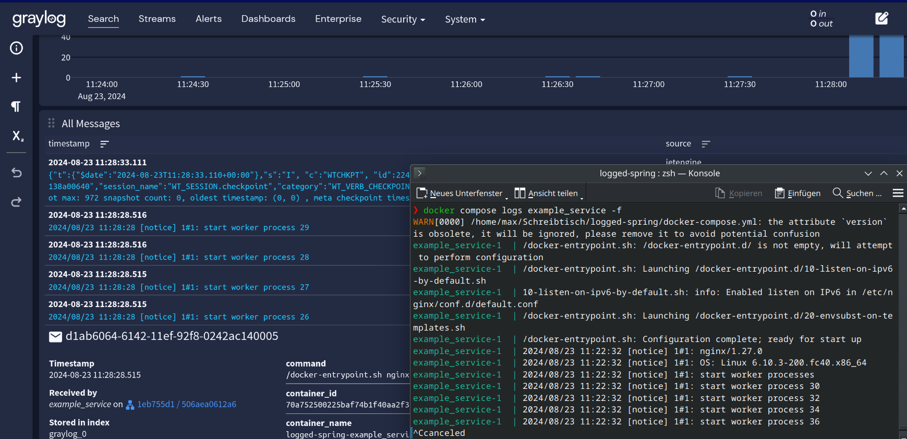
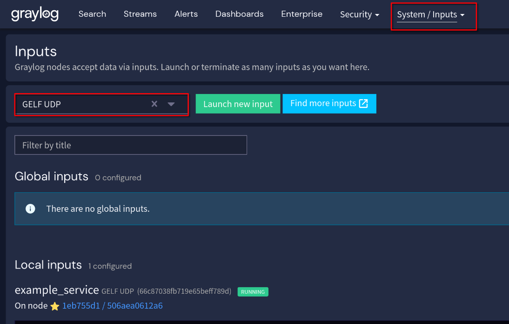

Mit folgender compose-konfiguration kann man graylog in sein System einbinden:

```yml
version: '3'
services:
  # MongoDB: Required for Graylog
  mongo:
    image: mongo:7.0.12
    volumes:
      - mongo_data:/data/db
    logging:
      driver: gelf
      options:
        gelf-address: "udp://localhost:12201"
        tag: "mongo"

  # Elasticsearch: Required for Graylog
  elasticsearch:
    image: docker.elastic.co/elasticsearch/elasticsearch-oss:7.10.2
    environment:
      - http.host=0.0.0.0
      - transport.host=localhost
      - network.host=0.0.0.0
      - "ES_JAVA_OPTS=-Xms512m -Xmx512m"
    volumes:
      - es_data:/usr/share/elasticsearch/data
    logging:
      driver: gelf
      options:
        gelf-address: "udp://localhost:12201"
        tag: "elasticsearch"
    ports:
      - 9200:9200 # not necessary to expose

  # Graylog
  graylog:
    image: graylog/graylog:6.0
    environment:
      - GRAYLOG_PASSWORD_SECRET=somepasswordpepper
      - GRAYLOG_ROOT_PASSWORD_SHA2=8c6976e5b5410415bde908bd4dee15dfb167a9c873fc4bb8a81f6f2ab448a918 # admin when unhashed
      - GRAYLOG_HTTP_EXTERNAL_URI=http://127.0.0.1:9000/
      - GRAYLOG_ELASTICSEARCH_HOSTS=http://elasticsearch:9200 # needs to match elastichsearch hostname
    links:
      - mongo
      - elasticsearch
    depends_on:
      - mongo
      - elasticsearch
    ports:
      - 9000:9000 # Graylog web interface and REST API
      - 12201:12201/udp # GELF UDP
      - 1514:1514 # Syslog TCP
    volumes:
      - graylog_data:/usr/share/graylog/data

  # Example of another service in the compose setup
  example_service:
    image: nginx:latest
    ports:
      - 80:80
    logging:
      driver: gelf
      options:
        gelf-address: "udp://localhost:12201"
        tag: "example_service"

volumes:
  mongo_data:
  es_data:
  graylog_data:
```

Hier werden die Logs vom `example_service`, einer `nginx`-Instanz aufgezeichnet und gespeichert. Dozzle, im Gegensatz zu Graylog, speichert keine Logs. 


> In Graylog und in compose werden die (beinahe) gleichen Logs angezeigt.

## Input definieren

Damit Graylog weiß wo es seine logs herbekommen kann, müssen entsprechende Inputs definiert werden:



Die Input-Definition muss mit der Logging-Treiber Konfiguration in compose übereinstimmen:

```yml
    logging:
      driver: gelf
      options:
        gelf-address: "udp://localhost:12201"
        tag: "example_service"
```

Hier wurde ein GELF-Treiber verwendet, welcher über UDP mit Graylog kommuniziert.


## Aufgabe

Füge zu einem Spring-Projekt Graylog, Elasticsearch und MongoDB hinzu, um somit immer auf die Logs deiner Anwendung zugreifen zu können. 
