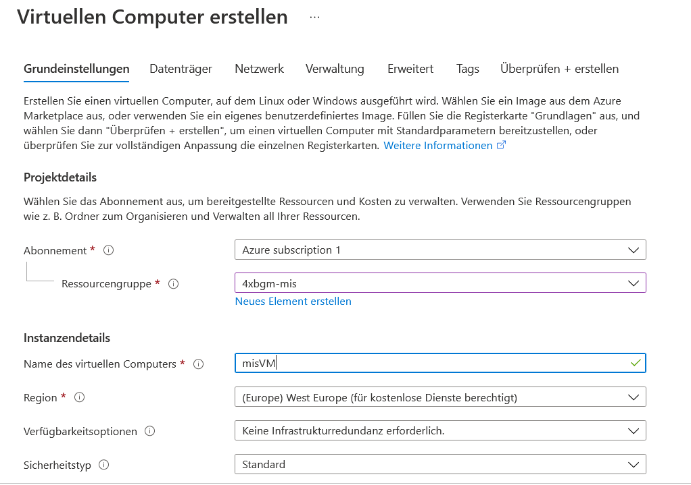
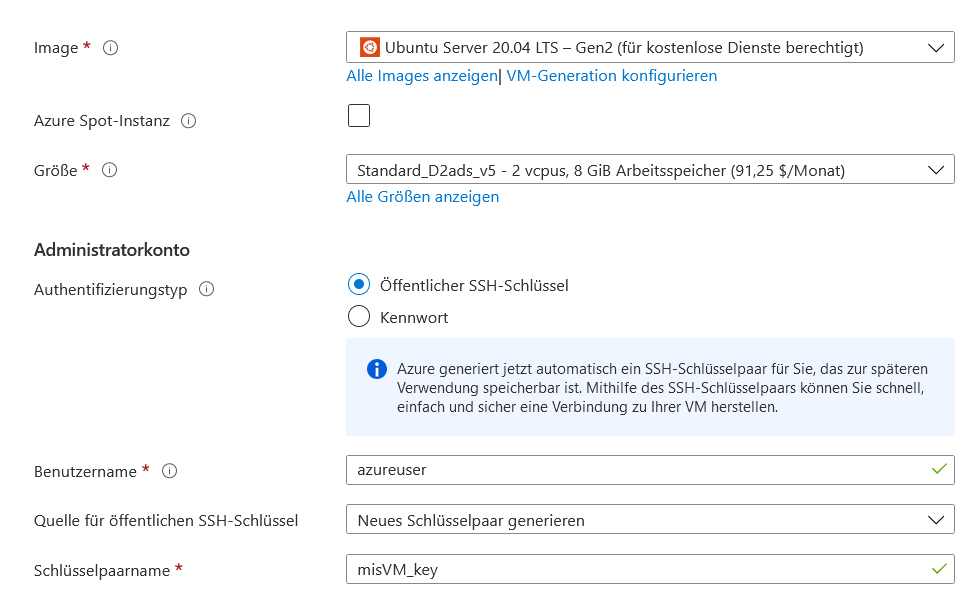
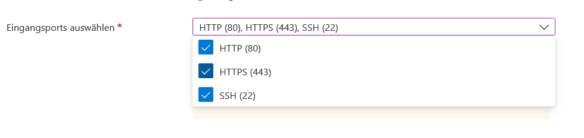
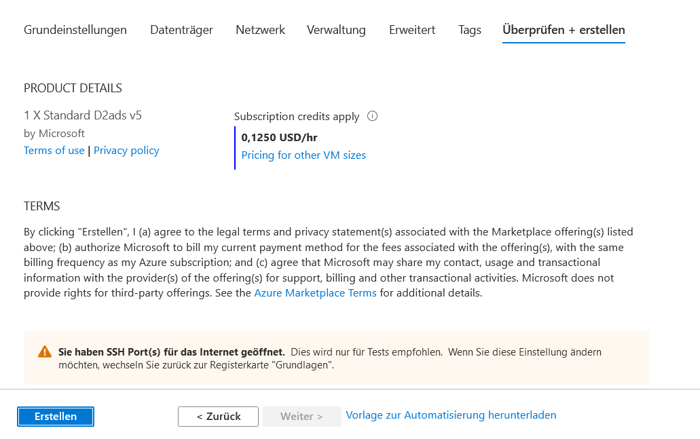
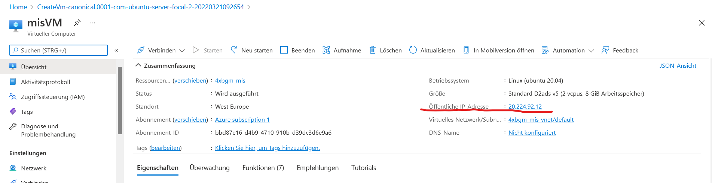
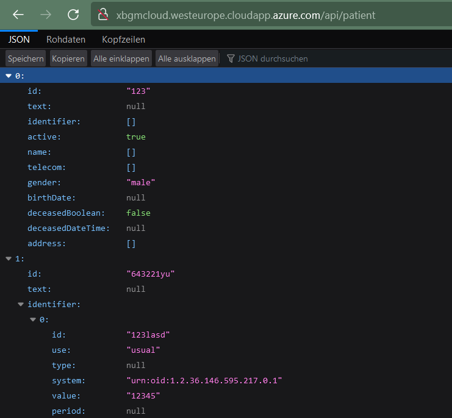

# Azure Deployment

## VM Anlegen

1. Auf [portal.azure.com](https://portal.azure.com) mit der Spengergasse-Email anmelden
2. Zum `Virtuelle Computer` Menü gehen

Auf erstellen klicken, dannach auf `Azure VM`

Wähle eine bestehende Ressourcengruppe aus oder erstelle ggf. eine neue. Leg einen beliebigen Namen fest. Am besten mit deinem Kürzel oder intialen um doppelte Benennungen zu vermeiden.

Erstelle eine VM entweder mit Ubuntu oder alternativ mit einer Distribution mit der du dich gut auskennst. Zum authentifizieren ist ein SSH-Schlüssel empfehlenswert da man sich kein Passwort merken muss.

Bei den Eingangsport brauchen wir alle verfügbaren Ports. Über Port 80 werden wir später auf unsere Webanwendung zugreifen. Über Port 22 können wir eine Konsole der VM erreichen.

Klicke dann auf `Überprüfen + erstellen` die Zusammenfassung sollte folgendermaßen aussehen: 

**WICHTIG** beim Klick auf `Erstellen` erstellt Azure uns einen privaten Schlüssel in einer pem-Datei. Diesen brauchen wir um uns einloggen zu können. Unbedingt herunterladen!

In der Übersichtsseite können wir die akteulle IP unserer VM einsehen:

Mit folgendem Befehl können wir uns jetzt in eine Konsole der VM einloggen:

`ssh -i <dein-schlüsselname>.pem azureuser@<ip-deiner-vm>`

In meinem Fall (**bei dir anders**) sieht der Befehl so aus:

`ssh -i .\misVM_key.pem azureuser@20.224.92.12`

Erscheint eine Konsole mit grünem Text, hat der Login funktioniert.

##### Daten übertragen in die VM

Im nächsten Schritt müssen wir user Projekt in die VM übertragen. Dazu eignet sich der Befehl `sftp`.

Ähnlich wie bei SSH ist die Befehlsstruktur hier:

`sftp -i <dein-schlüsselname>.pem azureuser@<ip-deiner-vm>`

Dannach erschreint der Promt `sftp>` welcher FTP-Befehle entgegen nimmt. Mit `put <dateiname>.zip` können wir eine Datei von einem lokalen Ordner in die VM verschieben.

Nachdem die Projektdateien verschoben sind können wir uns wieder mit SSH auf der VM einloggen und mit der Installation beginnen. Zunächst sollte man wie bei jeder neuen Linux-Installation ein update durchführen. Das funktionier unter Ubuntu mit

`sudo apt-get update -y`

Ist das Update fertig können wir diverse Programme installieren. Wir benötigen docker und compose fürs Ausführen sowie unzip um die zip-Datei zu entpacken. Als kleines Hilfsprogramm noch dos2unix.

`sudo apt install docker docker-compose unzip dos2unix -y`

Nun können wir mit `unzip <dateiname>.zip` unser Projekt auspacken. Um in den darin erstellen Ordner zu wechseln gibt es das Kommando `cd <dein-projektordner>`.

## compose ausführen
 Das funktioniert - wie unter Windows auch - mit `docker-compose up`. Innerhalb des containers wird dann das `Dockerfile` aufgebaut und ausgeführt. 

### Port 8080 in compose ummappen

Wie in einem oberen Screenshot ersichtlich werden in Azure nur die Ports 22, 80 und 443 veröffentlicht. Da unsere Spring-Anwendung jedoch auf dem Port 8080 arbeitet müssen wir den Netzwerkverkehr umleiten.

Durch verändern der docker-compose.yml-Datei ist das ganz einfach möglich. Wie der innere auf den äußeren Port umgeleitet wird, wird immer foldendermaßen angegeben: `<aussenport>:<innenport>`. Statt `8080:8080` müssen wir also `80:8080` schreiben.

## Webservice aufrufen

Rufe die aktuelle IP (oder in meinem Fall habe ich eine Domain hinterlegt) auf und sieh nach ob eine Antwort zurückkommt. Bei mir wird folgendes JSON retourniert:

