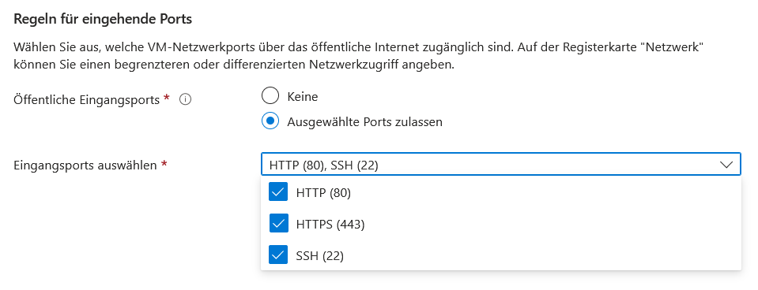

## Virtuellen Computer anlegen

1. Auf [portal.azure.com](https://portal.azure.com) mit der Spengergasse-Email anmelden

> WICHTIG: Während der Anmeldung niemals Kreditkartendaten angeben. Falls Azure das verlangt nochmal prüfen ob ihr ein Studentenkonto erstellt habt. 

2. Zum `Virtuelle Computer` Menü gehen


Auf erstellen klicken, dannach auf `Azure VM`


Wähle eine bestehende Ressourcengruppe aus oder erstelle ggf. eine neue. Leg einen beliebigen Namen fest. Am besten mit deinem Kürzel oder intialen um doppelte Benennungen zu vermeiden. 


Erstelle eine VM entweder mit Ubuntu oder alternativ mit einer Distribution mit der du dich gut auskennst. Zum authentifizieren ist ein SSH-Schlüssel empfehlenswert da man sich kein Passwort merken muss.


Bei den Eingangsport brauchen wir SSH (22) und HTTP (80). Über Port 80 werden wir später auf unsere Webanwendung zugreifen. Über Port 22 können wir eine Konsole der VM erreichen. Wenn du willst kannst du auch versuchen HTTPS einzurichten, ist aber für diese Übung nicht notwendig. 



Klicke dann auf `Überprüfen + erstellen` die Zusammenfassung sollte folgendermaßen aussehen: 


Nachdem die Ressource erstellt wurde bekommt man folgende Bestätigung:


> **WICHTIG** beim Klick auf `Erstellen` erstellt Azure uns einen privaten Schlüssel in einer pem-Datei. Diesen brauchen wir um uns einloggen zu können. Unbedingt herunterladen!


In der Übersichtsseite können wir zum einen die aktuelle IP unserer VM einsehen, als auch einen DNS-Namen festlegen:


Mit folgendem Befehl können wir uns jetzt in eine Konsole der VM einloggen:

`ssh -i <dein-schlüsselname>.pem azureuser@<ip-deiner-vm>`

In meinem Fall (**bei dir anders**) sieht der Befehl so aus:

`ssh -i asphost_key.pem azureuser@108.143.154.216`

Bevor man sich zum ersten mal einloggt fragt einen SSH ob man 
der Gegenseite vertraut. 

```console
The authenticity of host '108.143.154.216 (108.143.154.216)' can't be established.
ED25519 key fingerprint is SHA256:gspN+LirQ+6X4C3m9EX1Fc6fbMxv/GQ66FPvyFnXYUU.
This key is not known by any other names
Are you sure you want to continue connecting (yes/no/[fingerprint])?
```

Hier muss man `yes` eingeben bevor eine Verbindung aufgebaut wird. Für den am Anfang häufigen Fehler `Unprotected Key file` gibt es hier: [https://superuser.com/questions/1296024/windows-ssh-permissions-for-private-key-are-too-open](https://superuser.com/questions/1296024/windows-ssh-permissions-for-private-key-are-too-open) Lösungsansätze.


Erscheint dann eine Konsole mit grünem Text, hat der Login funktioniert. Für den nächsten Schritt müssen wir kurz zurück auf den eigenen Rechner wechseln. Das geht mit dem Befehl `exit`.

##### Daten übertragen in die VM

Im nächsten Schritt müssen wir user Projekt in die VM übertragen. Dazu eignet sich der Befehl `sftp`. Der Name steht für SSH File Transfer Protocol. Da FTP unverschlüsselt ist sollte man davon absehen es in seiner normalen Form zu verwenden. 

Ähnlich wie bei SSH ist die Befehlsstruktur hier:

`sftp -i <dein-schlüsselname>.pem azureuser@<ip-deiner-vm>`

Dannach erschreint der Prompt `sftp>` welcher FTP-Befehle entgegen nimmt. Mit `put <dateiname>.zip` können wir eine Datei von einem lokalen Ordner in die VM verschieben. Sobald alles verschoben wurde kann man auch hier mit `exit` wieder das Programm verlassen.

Nachdem die Projektdateien verschoben sind können wir uns wieder mit SSH auf der VM einloggen (`ssh -i ...`) und mit der Installation beginnen. Zunächst sollte man wie bei jeder neuen Linux-Installation ein update durchführen. Das funktioniert unter Ubuntu mit

`sudo apt update -y`

Ist das Update fertig können wir diverse Programme installieren. Wir benötigen Docker fürs Ausführen sowie unzip um die zip-Datei zu entpacken. Als kleines Hilfsprogramm noch dos2unix.

`sudo apt install  unzip dos2unix -y`


```sh
# Add Docker's official GPG key:
sudo apt-get update
sudo apt-get install ca-certificates curl
sudo install -m 0755 -d /etc/apt/keyrings
sudo curl -fsSL https://download.docker.com/linux/ubuntu/gpg -o /etc/apt/keyrings/docker.asc
sudo chmod a+r /etc/apt/keyrings/docker.asc

# Add the repository to Apt sources:
echo \
  "deb [arch=$(dpkg --print-architecture) signed-by=/etc/apt/keyrings/docker.asc] https://download.docker.com/linux/ubuntu \
  $(. /etc/os-release && echo "$VERSION_CODENAME") stable" | \
  sudo tee /etc/apt/sources.list.d/docker.list > /dev/null
sudo apt-get update
sudo apt install docker-ce -y
```

> [Quelle](https://www.c-sharpcorner.com/article/how-to-deploy-docker-in-ubuntu-server-using-azure-portal/)


Nun können wir mit `unzip <dateiname>.zip` unser Projekt auspacken. Um in den darin erstellen Ordner zu wechseln gibt es das Kommando `cd <dein-projektordner>`.


## Installation Docker und Deployment mit Caddy

Nachdem wir die Projektdateien auf die VM übertragen haben, erstellen wir zunächst die notwendigen Docker-Konfigurationsdateien für einen mehrstufigen Build-Prozess.

1. Erstelle in deinem Projektordner ein `Dockerfile`:
```dockerfile
# Build stage
# use latest lts node version
FROM node:22-alpine as builder

RUN apk add openssl

WORKDIR /app
COPY package*.json ./
RUN npm install
COPY . .
RUN npm run build

# use latest lts node version
FROM node:22-alpine

RUN apk add openssl

WORKDIR /app
COPY package*.json ./
RUN npm ci
COPY --from=builder /app/build ./build
COPY --from=builder /app/public ./public
COPY --from=builder /app/prisma ./prisma
RUN npm run prisma generate

EXPOSE 3000
CMD ["npm", "run", "start"]
```

Dass `prisma generate` funktioniert musst du darauf achten, dass im `package.json` in den `scripts` folgender eintrag ist: `"scripts": {"prisma": "prisma"}`


Um beim Befehl `COPY . .` nicht zu viele Daten zu übertragen kannst du die Datei `.dockerignore` hinzufügen. Alle darin aufgelisteten Dateien und Ordner werden nicht reinkopiert. Syntax ist ähnlich wie bei der `.gitignore`.

```
node_modules
```


2. Erstelle eine `Caddyfile` im Projektordner:
```
yourdomain.example.com {
    # Reverse proxy to Remix server
    reverse_proxy remix-app:3000 {
        header_up Host {host}
        header_up X-Real-IP {remote}
        header_up X-Forwarded-For {remote}
        header_up X-Forwarded-Proto {scheme}
    }

    # Enable compression
    encode gzip
}
```

3. Docker Compose für einfacheres Management:

Erstelle ein `docker-compose.yml`:
```yaml
services:
  remix-app:
    build: .
    restart: unless-stopped
    networks:
      - remix_network
    environment:
      - NODE_ENV=production
    volumes:
      - ./prisma:/app/prisma
    env_file: .env
      
  caddy:
    image: caddy:2-alpine
    restart: unless-stopped
    ports:
      - "80:80"
      - "443:443"
    volumes:
      - ./Caddyfile:/etc/caddy/Caddyfile
      - caddy_data:/data
      - caddy_config:/config
    networks:
      - remix_network
    depends_on:
      - remix-app

networks:
  remix_network:
    driver: bridge

volumes:
  caddy_data:
  caddy_config:
```

4. Deployment durchführen:
```bash
# Docker Compose starten
sudo docker compose up -d --build
```

## Wartung und Monitoring

1. Logs überprüfen:
```bash
# Container Logs anzeigen
sudo docker compose logs -f
```

2. Container neustarten:
```bash
sudo docker compose restart
```

3. Updates durchführen:

Funktioniert nur wenn man statt sftp die Daten zwischen privatem Rechner und Azure mit git überträgt.

```bash
# Neue Version pullen und Container neustarten
git pull
sudo docker compose down
sudo docker compose up --build -d
```

## Troubleshooting

### Häufige Probleme und Lösungen:

1. **Container startet nicht:**
   - Logs prüfen: `sudo docker compose logs`
   - Build-Logs prüfen: `sudo docker compose build --no-cache`
   - Ports prüfen: `sudo netstat -tulpn`

2. **Statische Assets werden nicht geladen:**
   - Prüfen Sie die Pfade in der Caddyfile
   - Verifizieren Sie die Build-Ausgabe: `sudo docker exec -it <container-id> ls /srv`

3. **Performance-Probleme:**
   - Container Ressourcen überprüfen: `sudo docker stats`
   - System-Ressourcen monitoren: `htop`
4. **Änderungen werden nicht übernommen**
  - Container muss bei jeder Änderung neu gebaut werden
  - Start mit `docker compose up -d --build`

## HTTPS einrichten

Für eine produktive Umgebung mit eigener Domain, ändere das Caddyfile wie folgt:

```
your-domain.com {
    root * /srv
    
    # Serve static files from build directory
    handle /build/* {
        file_server
    }
    
    # Serve static files from public directory
    handle /public/* {
        file_server
    }
    
    # Serve the index file for all other routes
    handle * {
        try_files {path} /build/index.html
    }

    # Enable compression
    encode gzip
}
```

Nach dem Ändern der Konfiguration:
```bash
sudo docker compose restart
```

## Sicherheitshinweise

1. Regelmäßige System-Updates:
```bash
sudo apt update && sudo apt upgrade -y
```

2. Docker-Images aktualisieren:
```bash
sudo docker compose pull
sudo docker compose up -d
```

3. Backup der Volumes:
```bash
docker run --rm \
    -v caddy_data:/data \
    -v $(pwd):/backup \
    alpine tar czf /backup/caddy_data_backup.tar.gz /data
```
