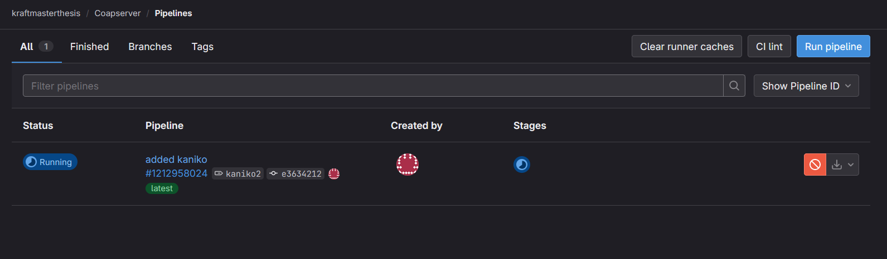

*Kaniko* is a tool that is able to build containers within a CI-Pipeline, a Kubernetes cluster, a compose deployment, or any other kind of microservice setup [source](https://github.com/GoogleContainerTools/kaniko). Gitlab suggests in their documentation to use Kaniko to build Docker images [source](https://docs.gitlab.com/ee/ci/docker/using_kaniko.html). If the containers shall be built automatically in a CI-Pipeline, it is important to enable pipelines in the project settings, as shown in [Figure 1](#figure-1).


#### Figure 1
> Project settings, on the very bottom, CI/CD has to be enabled


To use the CI/CD pipeline, a GitLab Runner has to be set up. It is a daemon that waits for build jobs. Whenever a CI pipeline job gets triggered on the GitLab project, the runner gets the command to first clone the repository in its current state. Within the `.gitlab-ci.yml` file, which has to be in the root of the cloned repository, all further instructions are specified.

At first, in the `.gitlab-ci.yml` file (see <a href="#Listing1">Listing 1</a>), an image is specified. Within that container, all further commands, such as building, testing, linting, etc., get executed. The image has to provide all the commands necessary to perform these steps.

```yaml
image: gradle:8.5.0-jdk21
stages:
  - deploy
deploy:
  stage: deploy
  tags:
    - any
  image:
    name: gcr.io/kaniko-project/executor:debug
    entrypoint: [""]
  script:
    - echo "{\"auths\":{\"$CI_REGISTRY\":\
      {\"username\":\"$CI_REGISTRY_USER\",\"password\":\
      \"$CI_REGISTRY_PASSWORD\"}"\ 
      > /kaniko/.docker/config.json
    - /kaniko/executor --context $CI_PROJECT_DIR \
      --dockerfile $CI_PROJECT_DIR/Dockerfile \
      --destination $CI_REGISTRY_IMAGE:$CI_COMMIT_TAG \
      --destination $CI_REGISTRY_IMAGE:latest \
  only:
    - tags
```
<a id="Listing1">**Listing 1: A sample gitlab-ci configuration file that uploads the generated container to the GitLab container registry, based on the official documentation from GitLab**</a>

In the [GitLab documentation](https://docs.gitlab.com/runner/install/linux-repository.html), there is a well-documented explanation of how to install a runner on a machine. Since Oracle Linux is based on CentOS, the command from Listing 2 has to be issued. This script adds the official GitLab repository. Once it is added, the command from Listing 3 installs the GitLab runner on the Oracle Cloud VPS instance.

```sh
curl -L "https://packages.gitlab.com/install/gitlab-runner/script.rpm.sh" | sudo bash
```
**Listing 2: Command to add the GitLab runner repository**

```sh
sudo yum install gitlab-runner
```
**Listing 3: Command to install a GitLab runner instance**


**Figure 2: Click "New Project runner" to add a new runner, under Project Settings > CI/CD Settings > Runners**

When the runner is registered, a command with the generated token is displayed. The command has to be executed on the VPS instance it is installed on. See Listing 4 for reference.

```sh
gitlab-runner register
--url https://gitlab.com
--token <TOKEN>
```
**Listing 4: The command generated by gitlab.com in order to register the runner on it**

When setting up a runner during the setup process, the program asks which executor to choose [source](https://docs.gitlab.com/runner/executors/). The most suitable executor for this thesis would be the *Docker* executor. It runs all the jobs within Docker containers. This ensures that on every new job, the build environment is cleanly set up. Due to compartmentalization, any issues from outside or inside the container do not have a big effect on each other. To prepare the runner, first, the secrets have to be set up as CI keys, as shown in Figure 3. Afterward, when a job starts, its status can be observed in the web view, as shown in Figure 4.


**Figure 3: Add secrets to GitLab to use them during the build process**


**Figure 4: First job running on the configured runner**


**Figure 5: After the job finished, Kaniko uploaded the image to the GitLab Container registry**

```yaml
version: "3"

services:
  coapserver:
    image: registry.gitlab.com/<username>/<imagename>:latest
    depends_on:
      - mysql
    ports:
      - "5683:5683/udp"
      - "5683:5683/tcp"
```
**Listing 5: A compose service definition using the image built by Kaniko**

After the image gets uploaded, as seen in Figure 5, it is possible to use it directly as an image in a Docker Compose file as shown in Listing 5.

### Using Docker Compose to manage container interactions and dependencies
In Section [docker](#docker), it was shown how Docker can be used to spawn new containers. With commands such as `docker run` and `docker network create`, a rich environment can be created for processes to run in a controlled and separated environment. For more complex deployments, such as those discussed in this thesis, the use of pure Docker has some drawbacks. For example, if the server software has to be hosted on another machine, various `docker ...` commands have to be issued, some in a predefined order. If even one command is missing, the whole deployment potentially does not work. To automate this, a shell script could be used, but it has to be crafted with great attention to detail, especially as more containers are added.

If a new container gets added that relies on other containers being already started, since it depends on their services, it can be important to place the new `docker run ...` command in just the right place to avoid unsatisfied dependencies.

*Docker Compose* is a tool that ships with Docker to help organize (also called orchestrating in the context of containers) large amounts of containers. Instead of issuing `docker` commands consecutively, a desired state is described in a YAML file.

According to the specification [source](https://docs.docker.com/compose/compose-file/compose-file-v3/), the top level is an associative list with the keys: `version`, `services`, `networks`, and `volumes`. The *version* indicates which Docker engine the file is compatible with and which version of the specification it complies with. Everything in the *services* section will be translated into `docker run` commands. Its location in the file does not indicate when it gets executed. If any container relies on pre-existing *networks* or *volumes*, they have to be added first either with `docker network create` or `docker volume create`. Even if no network is specified, Docker Compose will create one for the YAML file containing all the specifications on how the containers should be deployed. Within a network created by Docker Compose (or Docker in general), each container can send data packets to each other by addressing them via their name. Docker networks have a built-in DNS server for that [source](https://docs.docker.com/network).

In the example configuration of Listing 6, the Docker Compose file defines two services: a web server (NGINX) and a database (MySQL). The web service exposes port 80 and mounts a local directory (`./html`) to serve static content. Meanwhile, the database service is initialized with predefined environmental variables for the root password, database name, username, and password. Both services are connected to separate networks (`frontend` and `backend`), facilitating communication while maintaining isolation.

With *Kaniko*, it is possible to automatically build a new container whenever a new tag gets pushed to the upstream Git repository on gitlab.com. When this container gets deployed with Docker Compose (as seen in Listing 5), a new version has to be pulled manually. The URL for the built container from the Kaniko Section is available at `registry.gitlab.com/<username>/<imagename>:latest`. Using Kubernetes, this can be deployed automatically.

```yaml
version: '3.8'

services:
  web:
    image: nginx:latest
    ports:
      - "80:80"
    volumes:
      - ./html:/usr/share/nginx/html
    networks:
      - frontend
      - backend
  db:
    image: mysql:5.7
    environment:
      MYSQL_ROOT_PASSWORD: example
      MYSQL_DATABASE

  exampledb:
      MYSQL_USER: exampleuser
      MYSQL_PASSWORD: examplepass
    volumes:
      - db-data:/var/lib/mysql
    networks:
      - backend

networks:
  frontend:
  backend:

volumes:
  db-data:
```
**Listing 6: Example Docker Compose configuration with web server and database services, including networks and volumes**

