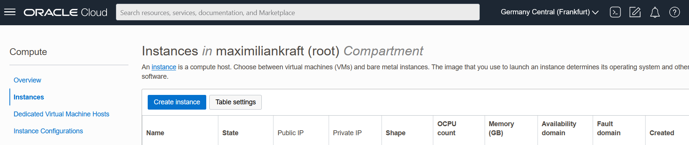
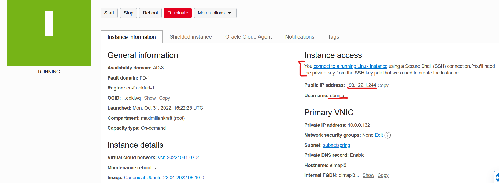
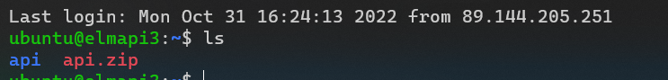
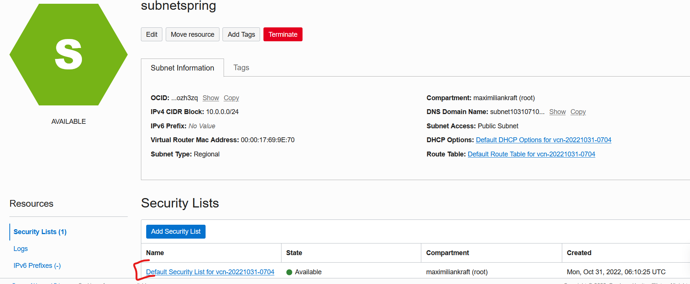
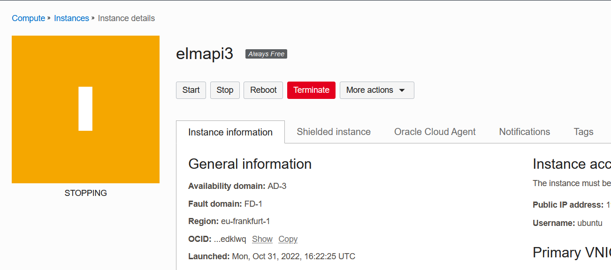

# Oracle Cloud Deployment

## Setup

Auf [cloud.oracle.com](cloud.oracle.com) einen Account anlegen. Um Fake-Accounts zu verhindern verlangt Oracle eine Kreditkarte zur Identitätsfeststellung. Wir werden nur Services verwenden die nichts kosten. Als zusätzliche Absicherung bekommt man in den ersten 30 Tagen 250€ welche man für alle möglichen Ressorucen aufbrauchen kann. Sollte dieser Wert nach unten gehen ist das ein Indikator das nicht freie Services verwendet wurden. Bleibt der Wert bei 250 kann man bedenkenlos über den Testzeitraum hinaus die `Free-Eligibel Services` verwenden. Jedoch nur diese, alles andere kostet Geld. 

## Deployment vorbereitungen
Um unserer Software möglichst einfach installierbar zu machen werden wir sie in einen Container packen. Dazu verwenden wir Docker. Das fertige Dockerfile sollte so wie [hier](https://spring.io/guides/topicals/spring-boot-docker/) in der Sektion `Multistage build` aussehen. Allerdings muss man mvnw gegen mvn austauschen und beim ersten FROM ein maven image nehmen. Z.b so `FROM maven:3-openjdk-17-slim as build`.

Um unsere Docker-Konfiguration noch leichter starbar zu machen können wir mir docker-compose mehrere Services auf einmal Konfigurieren, ihnen Volumes zuweisen, Port-Forwarding einrichten uvm. Unser Dockerfile sieht zunächst so aus: 

```yaml
version: "3"
services:
    api:
        build: "."
        ports:
            - "8080:8080"
```

## Instanz anlegen

In [cloud.oracle.com](cloud.oracle.com) einloggen und eine neue instanz erstellen



Zunächst muss man einen Namen für die Instanz festlegen. Als Basisbetriebssystem ist standardmäßig Oricle Linux ausgewählt. Wir werden mit Ubuntu arbeiten, mit einem klick auf den `Edit` Button kann man das ändern.


Andere Betriebssysteme wie CentOS wären auch möglich. Wichtig ist nur dass die Bezeichnung `Always free eligible` für das OS zutrifft. Ansonsten wird spätestens nach einem 30 Tage zeitraum die Nutzung verrechnet. 


Als nächstes müssen wir festlegen wie wir uns beim Verbindungsaufbau authentifizieren. Dazu fügen wir unseren **öffentlichen** SSH-Schlüssel ein.


Das wars auch schon mit dem Anlegen der Instanz. Wir können mit einem Klick auf `Create` die Provisionierung beginnen.


## SSH Verbindung öffnen

Zum Verbinden brauchen wir einen Usernamen, IP und ein Passwort. Das Passwort ist unser privater SSH-Schlüssel. Username und IP werden von der Oracle Cloud bereitgestellt.



In dem Fall kann ich mich jetzt mit dem Befehl

`ssh ubuntu@193.122.1.244 -i id_rsa` 

verbinden. Das generelle Schema ist

 `ssh <username>@<host> -i <pfad-zu-ssh-private-key>`

 Der private key liegt im Userverzeichnis im Ordner `.ssh`. Falls die Datei nicht gefunden wird kann es sein dass man den Befehl im Ordner `.ssh` ausführen muss oder den ganzen Pfad `-i C:\Users\<dein-username>\.ssh\id_rsa` angeben muss. Auch muss es nicht sein das die Schlüsseldatei `id_rsa` heisst. Es ist aber der Standardname. 

 Nach einem erfolgreichen Login über das SSH-Kommando sollte man eine Linux-Bash sehen:
 

Nun müssen wir noch unsere Programmdateien auf den Server bringen. Dafür gibt es das Programm `sftp`. Es routet das FTP-Protokoll über einen verschlüsselten SSH-Tunnel. 

Wir loggen uns also mit SSH ein und starten dann das FTP-Protokoll. Der login sieht daher mit 

`sftp ubuntu@193.122.1.244`

sehr ähnlich aus. Da der Host bereits gespeichert wurde (Datei `known_hosts` im `.ssh` Ordner) müssen wir den Schlüssel nicht noch einmal angeben. Wäre aber mit -i weiterhin möglich. 

Unser Spring Projekt können wir in eine zip-Datei einpacken und dann via SFTP hochladen. Das können wir entweder in Windows machen (Rechte Maustaste -> Senden an -> zip komprimmierter Ordner). Um die Dateigröße aber möglichst klein zu halten ist es besser das Kommando `git archive` zu verwenden. Dieses wird keinen Dateien welche im `.gitignore` Ordner zur zip-Datei hinzufügen. Alle möglichen Buildartefakte aus dem target-Ordner, IntelliJ konfigurationen usw. kommen also garnicht erst ins zip. Mit 

`git archive HEAD --format=zip -o springproject.zip`

bekommen wir vom aktuellsten commit weg (HEAD) eine Zip Datei (--format=zip) welche also springproject.zip (-o) gespeochert wird. Wenn wir das obige sftp-kommado nun starten kommt eine neue shell mit `>` als Prompt.


Mit dem ftp-Kommando `put <pfad/dateiname>` wird die datei in unser Homeverzeichnis auf der Oracel instanz hochgeladen.

Geht man jetzt wieder mit ssh in die Oracle Instanz und lässt sich mit ls alle Dateien anzeigen wird man die Datei vorfinden:



Über das Kommando `unzip` kann man unter Ubuntu zip-Dateien entpachen. Dieses Programm (und docker) ist jedoch noch nicht installiert. Programme bzw. Pakete kann man in Ubuntu mit dem Paket-Verwaltungstool `apt` installieren. Beim ersten Start der Instanz muss man zunächst die Paketquellen aktualisieren. Das funktioniert mit:

`sudo apt update -y`

Sudo führt dazu das der nachfolgende Befehl mit Administratorrechten ausgefürt wird. Normalwerweise wird man dann gefragt ob man es wirklich installiern will, mit `-y` kann man diesen Schritt überspringen. 

Ist alles geupdated können wir die für uns notwendigen Programme auf einmal alle mit 

`sudo apt install unzip docker docker-compose -y` 

installieren. 

Ist alles installiert kann man nicht sofort unzip verwenden. Das Programm würde alles in den aktuellen Ordner entpacken. Mit `mkdir springproject` können wir einen neuen Ordner anlegen. Durch `mv <deine-zip>.zip springproject/<deine-zip>.zip` können wir die Datei in den neu erstellen unterordner schieben. Nun können wir mit `cd springproject` in den Ordner reingehen und mit `unzip <deine-zip>.zip` die Zipdatei entpacken. 

Über docker-compose wird nun das Dockerfile aufgebaut. Im Docker-compose.yml ist einiges bereits vordefiniert. Wir müssen nur mit `sudo docker-compose up -d` den Container starten. 

Sobald das Programm gestartet ist, ist es theoretisch von überall aus dem Internet erreichbar. Praktisch hat Oracle aber zu unserer Sicherheit noch eine Firewall eingebaut die wir zunächst locken müssen.

## Firewall konfigurieren

Unsere Firewall können wir via unserer virtuellen Netzwerkkarte (VNIC) konfigurieren. Dazu müssen wir unser Subnet editieren. Bei mir heisst es `subnetspring`.


In besagten subnet müssen wir bei den Security Lists einstellen welche Port von wo nach wo in welcher Range durchdürfen



Dazu müssen wir eine neue Regel für eingehende Verbindungen (ingress rule) erstellen.


Durch die Quell-IP `0.0.0.0` mit dem Prefix `/0` geben wir an das die IP von überall kommen darf. In einer Perfekten Welt gäbe es eine IP-Gruppe für jedes Land. Dann könnten wir mit `43.0.0.0/0` z.B sagen das nur verbindungen aus Österreich erlaubt sind. In der Praxis müsste man das für jeden Provider machen wenn man das einstellen wollen würde. Das Feld für den Quellport lassen wir frei, damit sind alle erlaubt. Als Destination Port wählen wir Port 80. Den Port des HTTP-Protokolls. Spring operiert zwar auf port 8080, jedoch wurde in unserem Docker-compose alles von 8080 auf 80 umgeleitet. 


Nun da die Firewall eingestellt ist, der Server im Hintergrund läuft und auch sonst alles Reibungslos funktioniert hat können wir unsere API via HTTP aufrufen. Über Firefox bekommen wir auf unseren GET-Request z.B folgende Antwort (habe bei mir dann doch 8080 statt 80 verwendet):


Um die Oracle-Server nicht unnötig zu belasten sollten wir unseren Server wenn wir ihn nicht brauchen auch wieder Herunterfahren. In der Instanzverwaltung dazu einfach auf den Stop-Button klicken und ein force-shutdown starten:


Über den Start-Button kann man die Instanz jederzeit wieder starten, sich mit SSH einloggen und weitermachen. 
