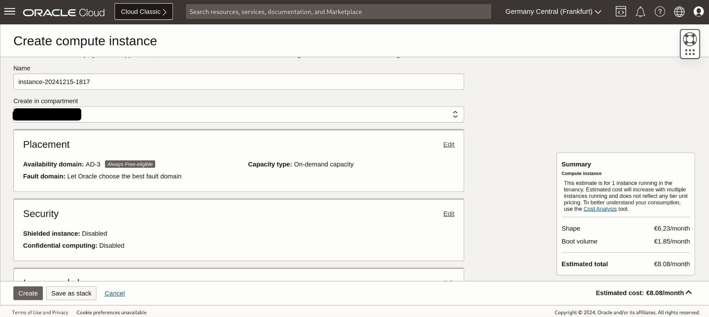

Reverse [ssh](https://www.openssh.com/) tunnels allow you to use any publicly available IP-Address to relay the traffic to a (more powerful) server where the requests get handled. Aside from that, SSH is mainly used for remotely operating computers. It is available [virtually everywhere](https://www.openssh.com/users.html). 

For demonstration, I will use a freely available Oracle Cloud Instance. It is not very powerful but the limited features suffice for this task. Using similarly small systems on Azure or any privately hosted systems with access to a public IP will yield similar results. 

## Creating a Compute-Instance on Oracle Cloud

The created *Always-Free* eligible instance would cost just about 8€ per month. If it was a paid account. Since an *Always-Free* account is used, there won't be any charges. It just has one CPU and 6 GB of RAM. The used CPU `VM.Standard.A1.Flex` is so small that the VM is barely useable. You cannot perform any updates, or run any resource-intensive command. The system would just crash. But for using pure SSH tunneling this free setup is sufficient. 



## Setup of the Raspberry Pi

Install the latest operating system, using [rpi imager](https://www.raspberrypi.com/software/). Using a Raspberry Pi is not mandatory. Any system behind any (standard) firewall can be used. On your host, (e.g a raspberry pi or your notebook) run `ssh-keygen`.


On the VPS (Oracle, Azure etc.) add the generated puslic key to the authorized_keys file. When your system attempts to connect to the VPS, it will verify it's identity via a key exchange. The public key (which the VPS has access to) gets used to encrypt a message. On the host it will be decrypted using its private key. It then gets encrypted with the public key of the VPS. On the VPS arriving message of the roundtrip gets decrypted. If it is the same random message as the initial message, access is granted. 


On your host, install Docker.

> [Instructions for the Raspberry Pi](https://www.heise.de/news/Wie-man-Docker-auf-dem-Raspberry-Pi-in-15-Minuten-einrichtet-7524692.html)

## Firewall setup

### Open Ports on your (Oracle) VPS 

The Virtual Machine created, need to be able to accept the Ports 80 and 443. For this, 

> https://stackoverflow.com/a/54835902/17996814

open firewall port 80:

```
sudo firewall-cmd --zone=public --permanent --add-port=80/tcp
sudo firewall-cmd --reload
```

## allow non-root users to use ports below 1024 on vps

https://superuser.com/questions/710253/allow-non-root-process-to-bind-to-port-80-and-443

/etc/sysctl.d/50-unprivileged-ports.conf is just a link to ../sysctl.conf, just add the line

net.ipv4.ip_unprivileged_port_start=0

there


## test connection

on the raspberry start a basic nginx container or your desired webservice. Use a docker-compose.yml that looks like this:

```
services:
  nginx:
    image: nginx
    ports:
     - "80:80"
```

Start it using docker compose up -d

## set up reverse ssh tunnel

https://www.jeffgeerling.com/blog/2022/ssh-and-http-raspberry-pi-behind-cg-nat

If it works with ssh, you can also utilize it for HTTP(s) 

using
```python
ssh -nNTv -R 0.0.0.0:80:0.0.0.0:80 opc@your.server.ip
```

to open multiple tunnels, use 
```python
ssh -nNTv -R 443:0.0.0.0:443 -R 80:0.0.0.0:80 opc@your.server.ip
```

## setting up dynamic dns service from afraid.org

