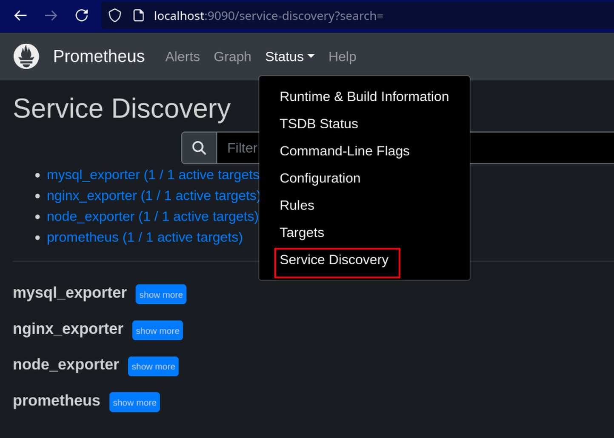
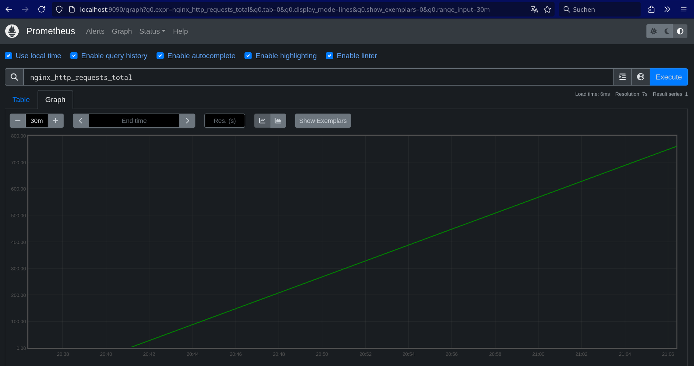
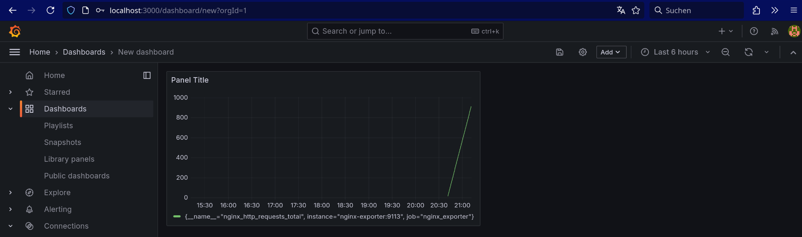

> Beispielhafte Implementierung [hier (github.com)](https://github.com/maximiliankraft/spring-prometheus-example)

Wenn eine Anwendung fertig ist und diese auf einem Server deployed wurde ist es weiterhin wichtig den Überblick zu behalten. Hacker könnten versuchen sich Zutritt zu verschaffen. Benutzer einen Fehler auslösen etc. Bedient man sich des Begriffs DevOps geht es jetzt hauptsächlich um die Operations (Ops). Die Entwicklung (dev) ist so gut wie abgeschlossen. Um den Status der Server überwachen zu können kann man [Prometheus](http://prometheus.io/) verwenden. 

Prometheus verwendet einerseits *exporter* um Daten zu sammeln. Exporter sind Container, welche andere Container überwachen. Dabei muss man für jeden Service einen eigenen Exporter nehmen. Für weit verbreitete Services wie MySQL, nginx, redis etc. gibt es bereits vordefinierte Exporter ([siehe Liste](https://prometheus.io/docs/instrumenting/exporters/)). Den Host kann man über den [node exporter](https://prometheus.io/docs/guides/node-exporter/) überwachen. Man kann aber auch für seinen eigenen Service einen schreiben. Die Leistungsdaten der Exporter werden dann von einem Prometheus Container zentral gesammelt. Mittels *service discovery* erkennt prometheus welche Exporter sich im aktuellen virtuellen Netzwerk befinden. 




Durch Abfragen kann man dann ein Diagramm der Werte sich zeichnen lassen. Auch kann man Alerts anlegen wenn bestimmte Bedingungen eintreten. Z.b wenn eine Fehlermeldung auftritt oder die CPU Last beständig über 90% liegt. In dem Fall sollte man sich die Logs ansehen. Dafür kann man einen ELK-Stack verwenden. Nachdem das aber auch viel Aufwand zum Einrichten ist kann man auch als abgespeckte Variante Dozzle nehmen. 

In einem Praktischen Beispiel habe ich Prometheus mit Spring verküpft. Nachdem die Anwendung nicht direkt scanbar ist, scannen die Exporter MySQL und nginx. Ist die Last auf die Datenbank oder den Webproxy also sehr hoch, kann man daraus ableiten dass es ein Problem gibt. 

Zunächst muss man daher mal den gesamten an Spring gerichteten Traffic via nginx routen. Und in der Production-Umgebung muss man MySQL als Datenbank einstellen (Zum entwickeln habe ich H2 verwendet).

Das geht über folgende Config-Datei:

```nginxconf
events {

}

http {

server {
     listen 80;
     listen [::]:80;
     server_name _;
     # logging
     access_log /var/log/nginx/access.log combined buffer=512k flush=1m;
     error_log /var/log/nginx/error.log warn;

     # reverse proxy
     location / {
       proxy_pass http://spring:8080;
       proxy_set_header Host $host;

       proxy_set_header X-Forwarded-For $proxy_add_x_forwarded_for;
       proxy_set_header X-Forwarded-Proto $scheme;
       proxy_set_header X-Real-IP $remote_addr;
       proxy_redirect off;       
     }

     location /stub_status {
        stub_status on;
    }

   }
}
```

Der nginx Container sieht so aus:

```Dockerfile
FROM nginx:latest
COPY . /etc/nginx/
```

Mit dem `COPY`-Kommando wird die nginx.conf-Datei dann an den richtigne Ort im Container kopiert. Könnte man auch über einen *mount* in compose erreichen. 


Auch braucht man die Exporter-Container. Die muss man nur herunterladen und im Compose einbinden:

```yml
...
  mysql-exporter:
    image: prom/mysqld-exporter
    depends_on:
     - mysql
    command:
     - --config.my-cnf=/cfg/.my.cnf
     - --mysqld.address=localhost:3306
    volumes:
      - "./observability/mysql/.my.cnf:/cfg/.my.cnf"
    ports:
      - 9104:9104
  nginx-exporter:
    image: nginx/nginx-prometheus-exporter:0.11.0
    depends_on:
      - nginx
    command:
      - -nginx.scrape-uri=http://nginx:80/stub_status
    ports:
      - "9113:9113"
  node_exporter:
    image: quay.io/prometheus/node-exporter:latest
    container_name: node_exporter
    command:
      - '--path.rootfs=/host'
    network_mode: host
    pid: host
    restart: unless-stopped
    volumes:
      - '/:/host:ro,rslave'
    ports:
      - "9113:9113" # forwarding not required
```

Nachdem das erledigt ist kann man auch schon Prometheus öffen und sich die Daten ansehen:




Auch ist es möglich über Grafana auf die Daten zuzugreifen, sieht dann etwas schöner aus und man kann mehrere Diagrammarten nebeneinander zusammenstellen: 



## Alerts

Diese sind in der Datei `rules.yml` zu definieren. In compose kann man diese Datei über einen *mount* hinzufügen:

```yml
- "./rules.yml:/etc/prometheus/rules.yml"
```

Der Aufbau innerhalb der YML-Datei wird in den [docs](https://prometheus.io/docs/prometheus/latest/configuration/alerting_rules/) beschrieben. Auch wird hier darauf hingewiesen dass die Alarme alleine nur auf dem Prometheus-Dashboard angezeigt werden, es kein Rate-Limiting gibt etc. Wenn man ein Werkzeug braucht dass einem den richtigen Alarm **sofort** anzeigt muss man sich einen [AlertManager](https://prometheus.io/docs/alerting/latest/alertmanager/) einrichten.

## Schnelle Logging-Lösung

Und sollte mal ein *alert* kommen, kann man mit [Dozzle](https://hub.docker.com/r/amir20/dozzle) schnell nachsehen worans denn liegt. Professioneller wäre es natürlich die Logs dann auch zu speichern und das nicht der Docker-Engine zu überlassen. Dafür gäbe es Lösungen wie flutend, logstash etc. Dozzle hat dafür den Vorteil dass es schnell in compose eingerichtet werden kann. Folgende Servicedefinition muss man hinzufügen:

```yml
services:
  dozzle:
    container_name: dozzle
    image: amir20/dozzle:latest
    volumes:
      - /var/run/docker.sock:/var/run/docker.sock:ro
    ports:
      - 8888:8080
```
