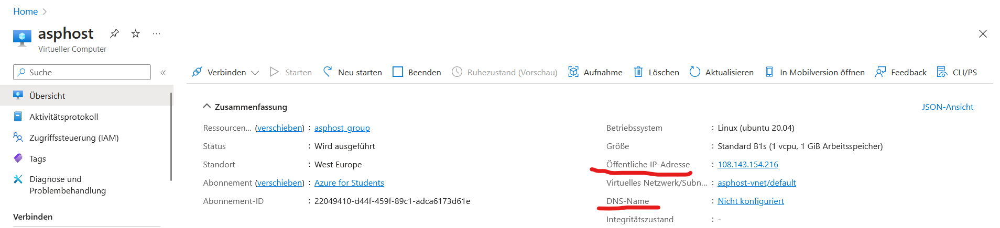

## Virtuellen Computer anlegen

1. Auf [portal.azure.com](https://portal.azure.com) mit der Spengergasse-Email anmelden

> WICHTIG: Während der Anmeldung niemals Kreditkartendaten angeben. Falls Azure das verlangt nochmal prüfen ob ihr ein Studentenkonto erstellt habt. 

2. Zum `Virtuelle Computer` Menü gehen


Auf erstellen klicken, dannach auf `Azure VM`


Wähle eine bestehende Ressourcengruppe aus oder erstelle ggf. eine neue. Leg einen beliebigen Namen fest. Am besten mit deinem Kürzel oder intialen um doppelte Benennungen zu vermeiden. 


Erstelle eine VM entweder mit Ubuntu oder alternativ mit einer Distribution mit der du dich gut auskennst. Zum authentifizieren ist ein SSH-Schlüssel empfehlenswert da man sich kein Passwort merken muss.


Bei den Eingangsport brauchen wir SSH (22) und HTTP (80). Über Port 80 werden wir später auf unsere Webanwendung zugreifen. Über Port 22 können wir eine Konsole der VM erreichen. Wenn du willst kannst du auch versuchen HTTPS einzurichten, ist aber für diese Übung nicht notwendig. 


Klicke dann auf `Überprüfen + erstellen` die Zusammenfassung sollte folgendermaßen aussehen: 


Nachdem die Ressource erstellt wurde bekommt man folgende Bestätigung:


> **WICHTIG** beim Klick auf `Erstellen` erstellt Azure uns einen privaten Schlüssel in einer pem-Datei. Diesen brauchen wir um uns einloggen zu können. Unbedingt herunterladen!


In der Übersichtsseite können wir zum einen die aktuelle IP unserer VM einsehen, als auch einen DNS-Namen festlegen:



Mit folgendem Befehl können wir uns jetzt in eine Konsole der VM einloggen:

`ssh -i <dein-schlüsselname>.pem azureuser@<ip-deiner-vm>`

In meinem Fall (**bei dir anders**) sieht der Befehl so aus:

`ssh -i asphost_key.pem azureuser@108.143.154.216`

Bevor man sich zum ersten mal einloggt fragt einen SSH ob man 
der Gegenseite vertraut. 

```console
The authenticity of host '108.143.154.216 (108.143.154.216)' can't be established.
ED25519 key fingerprint is SHA256:gspN+LirQ+6X4C3m9EX1Fc6fbMxv/GQ66FPvyFnXYUU.
This key is not known by any other names
Are you sure you want to continue connecting (yes/no/[fingerprint])?
```

Hier muss man `yes` eingeben bevor eine Verbindung aufgebaut wird. Für den am Anfang häufigen Fehler `Unprotected Key file` gibt es hier: [https://superuser.com/questions/1296024/windows-ssh-permissions-for-private-key-are-too-open](https://superuser.com/questions/1296024/windows-ssh-permissions-for-private-key-are-too-open) Lösungsansätze.


Erscheint dann eine Konsole mit grünem Text, hat der Login funktioniert. Für den nächsten Schritt müssen wir kurz zurück auf den eigenen Rechner wechseln. Das geht mit dem Befehl `exit`.

##### Daten übertragen in die VM

Im nächsten Schritt müssen wir user Projekt in die VM übertragen. Dazu eignet sich der Befehl `sftp`. Der Name steht für SSH File Transfer Protocol. Da FTP unverschlüsselt ist sollte man davon absehen es in seiner normalen Form zu verwenden. 

Ähnlich wie bei SSH ist die Befehlsstruktur hier:

`sftp -i <dein-schlüsselname>.pem azureuser@<ip-deiner-vm>`

Dannach erschreint der Prompt `sftp>` welcher FTP-Befehle entgegen nimmt. Mit `put <dateiname>.zip` können wir eine Datei von einem lokalen Ordner in die VM verschieben. Sobald alles verschoben wurde kann man auch hier mit `exit` wieder das Programm verlassen.

Nachdem die Projektdateien verschoben sind können wir uns wieder mit SSH auf der VM einloggen (`ssh -i ...`) und mit der Installation beginnen. Zunächst sollte man wie bei jeder neuen Linux-Installation ein update durchführen. Das funktioniert unter Ubuntu mit

`sudo apt update -y`

Ist das Update fertig können wir diverse Programme installieren. Wir benötigen Docker fürs Ausführen sowie unzip um die zip-Datei zu entpacken. Als kleines Hilfsprogramm noch dos2unix.

`sudo apt install  unzip dos2unix -y`

`sudo snap install docker`

Nun können wir mit `unzip <dateiname>.zip` unser Projekt auspacken. Um in den darin erstellen Ordner zu wechseln gibt es das Kommando `cd <dein-projektordner>`.


## Installation mit nodejs

So wie man unter Windows mit dem Kommando `npm run ...` bzw. `npm start` eine nodejs-Anwendung ohne IDE ausführen kann, geht das auch unter Linux. Wenn man nur einen Konsolen-Zugriff hat geht es auch garnicht anders. Das Programm `npm` bzw. `node` muss aber erst installiert werden. Weil nodejs etwas langsam darin ist deren Pakete in den Paketmanager zu aktualisieren ist es besser man schaut sich an wie man von nodejs bereitgestellte Paketrepositories verwendet in denen immer die aktuelle Version enthalten ist. Eine Anleitung dazu gibt es [hier (github.com/nodesource/distributions)](https://github.com/nodesource/distributions?tab=readme-ov-file#installation-instructions-deb). 


Mit dem Kommando:

```console
npm run dev
```

kann man dann den Webserver starten. Dabei ist wichtig dass in dem Ordner in dem der Befehl ausgeführt wird sich die `package.json` Datei befindet. Was genau macht dieser Befehl? Mit `sudo` (superuser do) wird der nachfolgende Befehl als Administrator ausgeführt. `npm run dev` startet das Remix-Projekt. Genau der Befehl wird ausgeführt wenn man in einer IDE auf den Play-Button klickt. Wichtig ist noch die Zone an zulässigen IPs und den Port zu konfigurieren. Diese Einstellungen müssen in Vite vorgenommen werden. Ein Anleitung dazu gibt es [hier (vitejs.dev/config)](https://v3.vitejs.dev/config/server-options.html). Wichtig ist die Postion des `server`-Objekts:

```js
export default defineConfig({
  // ... other config

  server: {
    host: "0.0.0.0",
    port: 80
  }
});
```

 Der Port 80 ist der Standardport von HTTP. Man könnte jede Seite mit :80 dahinter aufrufen. Standardmäßig kann man ihn aber auch weglassen. Mit 0.0.0.0 erlaubt man jeder IP Adresse auf den Webserver zugreifen zu dürfen. Hätte man 10.0.0.0 dürften z.B nur IPs aus dem internen Netz Daten abfragen. Um zu prüfen ob eine eingehende Verbindung erlaubt ist, wird der AND Operator auf die Maske (`0.0.0.0`) und die eingehende IP z.B `80.167.22.58` angewandt. Wenn das Ergebnis mit der Maske übereinstimmt ist die Verbindung erlaubt. Nachdem jede Zahl kombiniert mit dem AND-Operator und einer 0 wieder 0 ergibt sind alle Verbindungen erlaubt. Manchmal sieht man auch die Schreibweise `0.0.0.0/0`. Die wird [hier](https://networkengineering.stackexchange.com/a/77604/60739) erklärt. 

