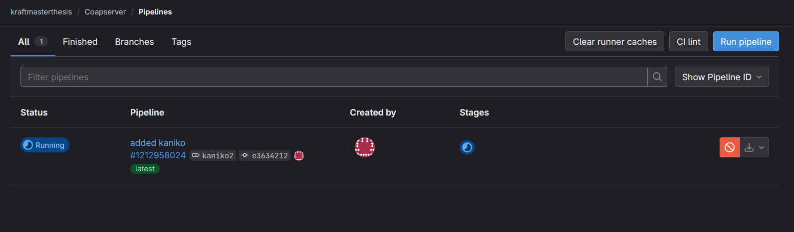

[Kaniko](https://github.com/GoogleContainerTools/kaniko) is a tool that is able to build containers within a CI-Pipeline, a Kubernetes cluster, a compose deployment, or any other kind of distributed containerized setup . Gitlab suggests in their [documentation](https://docs.gitlab.com/ee/ci/docker/using_kaniko.html) to use Kaniko to build Docker images. If the containers shall be built automatically in a CI-Pipeline, it is important to enable pipelines in the project settings, as shown in [Figure 1](#figure-1).


##### Figure 1
> Project settings, on the very bottom, CI/CD has to be enabled


To use the CI/CD pipeline, a GitLab Runner has to be set up. It is a daemon that waits for build jobs to be sent to it. Whenever a CI pipeline job gets triggered on the GitLab project, the runner gets the command to first clone the repository in its current state. Within the `.gitlab-ci.yml` file, which has to be in the root of the cloned repository, all further instructions are specified.

At first, in the `.gitlab-ci.yml` file (see [Listing 1](#listing-1)), an image is specified. Within that container, all further commands, such as building, testing, linting, etc., get executed. The image has to provide all the commands necessary to perform these steps.

##### Listing 1
> A sample gitlab-ci configuration file that uploads the generated container to the GitLab container registry, based on the official documentation from GitLab**

```yaml
build:
  stage: build
  variables:
    http_proxy: <your-proxy>
    https_proxy: <your-proxy>
    no_proxy: <your-no-proxy>
  image:
    name: gcr.io/kaniko-project/executor:v1.23.2-debug
    entrypoint: [""]
  script:
    - /kaniko/executor
      --context "${CI_PROJECT_DIR}"
      --build-arg http_proxy=$http_proxy
      --build-arg https_proxy=$https_proxy
      --build-arg no_proxy=$no_proxy
      --dockerfile "${CI_PROJECT_DIR}/Dockerfile"
      --destination "${CI_REGISTRY_IMAGE}:${CI_COMMIT_TAG}"
  rules:
    - if: $CI_COMMIT_TAG

```

Dockerfile for MIS Project

```Dockerfile

FROM alpine:3.20 as build

# gefunden auf: https://pkgs.alpinelinux.org
RUN apk add openjdk21-jdk
RUN apk add maven

RUN apk add nodejs-current

WORKDIR /build

COPY . . 

RUN mvn package -DskipTests

# ENTRYPOINT [ "sh" ]

FROM openjdk:21

WORKDIR /app

COPY --from=build /build/target/*.jar /app/app.jar


ENTRYPOINT ["java", "-jar", "-Dspring.profiles.active=docker", "/app/app.jar"]

```

In this [GitLab documentation](https://docs.gitlab.com/runner/install/docker.html), detailed instructions are shown how to install a Gitlab runner via Docker. 

##### Listing 2
> Gitlab Runner service-definition in Docker Compose

```yml
  runner:
    image: gitlab/gitlab-runner
    stdin_open: true
    tty: true
    volumes:
      - /var/run/docker.sock:/var/run/docker.sock
      - ./config:/etc/gitlab-runner
```

##### Figure 2
> Click "New Project runner" to add a new runner, under Project Settings > CI/CD Settings > Runners


When the runner is registered, a command with the generated token is displayed. The command has to be executed in the gitlab-runner container. See [Listing 2](#listing-2) for reference.

##### Listing 4
> The commands required to register the runner on gitlab

```sh
# start the runner-container
docker compose up runner -d

# get a shell into the container
docker compose exec runner bash

# register then runner (has to be executed inside the container)
gitlab-runner register --url https://gitlab.com --token <TOKEN>
```

When setting up a runner during the setup process, the program asks which executor to choose [source](https://docs.gitlab.com/runner/executors/). The most suitable executor for this thesis would be the **Docker** executor. It runs all the jobs within Docker containers. This ensures that on every new job, the build environment is cleanly set up. Due to compartmentalization, any issues from outside or inside the container do not have a big effect on each other. To prepare the runner, first, the secrets have to be set up as CI keys, as shown in Figure 3. Afterward, when a job starts, its status can be observed in the web view, as shown in [Figure 4](#figure-4).

##### Figure 4
> First job running on the configured runner



##### Figure 5
> After the job finished, Kaniko uploaded the image to the GitLab Container registry


It can then be used on any compose file or kubernetes deployment-definition as long as one has access to the registry:

```yaml
version: "3"

services:
  <name>:
    image: registry.gitlab.com/<username>/<imagename>:latest

```

