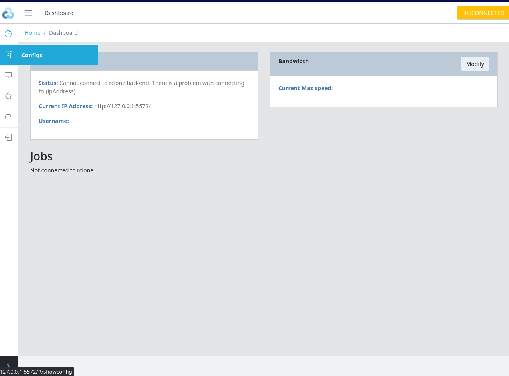
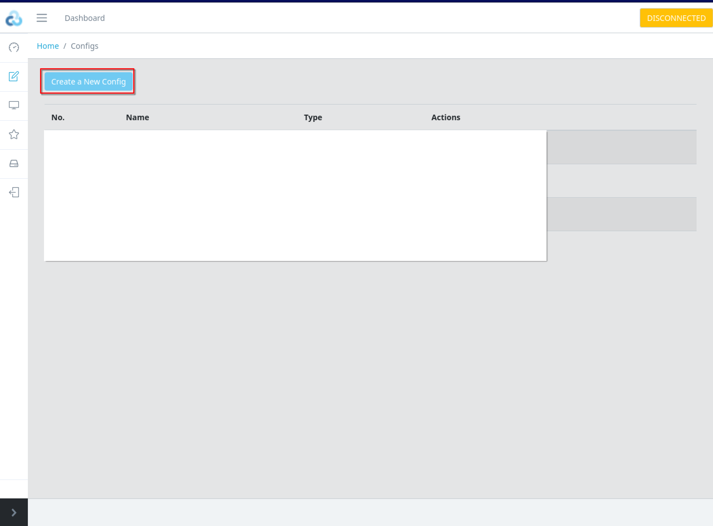

[rclone](https://rclone.org/) ist ein Programm zur Syncronisation von diveresen Cloudspeicher-Anbietern. Es gibt einige Cloud-Syncronisationsprogramme wie z.B Cyberduck o.ä, aber keines welches mir bekannt ist, ist komatibel zu [70]!(https://rclone.org/#providers) anbietern. Interessant hierbei sind neben den normalen Anbietern wie OneDrive, Google Drive etc. auch die `virtual provider`. Diese können die `storage provider` weiterverarbeiten. Mit dem *virtual provider* `Crypt` kann man z.B alle seine Dateien verschlüsselt auf einen *storage provider* hochladen. Erstellt man Backups von personenbezogenen Daten welche der DSGVO unterliegen kann das sehr Hilfreich sein um die darin enthaltenen Bestimmungen einzuhalten. Dann sind Serverstandorte außerhalb der EU kein Problem mehr. 

Benötigen bestimmte Services Datei-Übertragunsprotokolle wie FTP oder Webdav, kann man mit dem *virtual provider* `union` die Daten umleiten. Wobei es in den meisten Fällen ausreichend sein wird die Dateien lokal zu speichern. 


## rclone einrichten

Auch wenn rclone kein Kommandozeilen basiertes Programm ist, bietet es seit einiger Zeit eine [GUI](https://rclone.org/gui/) an. Diese ist allerdings noch nicht fertig implementiert. Mit dem Kommando:

```sh
rclone rcd --rc-web-gui
```

kann man die GUI starten. Im Bereich `Configs` in der Seitenleiste:



Dort dann auf `Create a New Config` klicken:



- Anleitungen für jeden *storage provider* gibt es [hier](https://rclone.org/docs/). 
- Eine Anleitung zum verschlüsselten hochladen [hier](https://rclone.org/crypt/)


## Aufgabe:

Erstelle einen Cronjob welcher alle 24 h einen Ordner verschlüsselt auf einen *storage provider* deiner Wahl hochlädt. Protokollliere deine Vorgehensweise. 