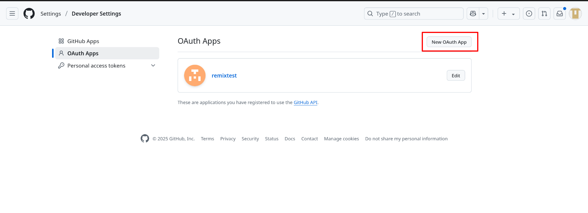
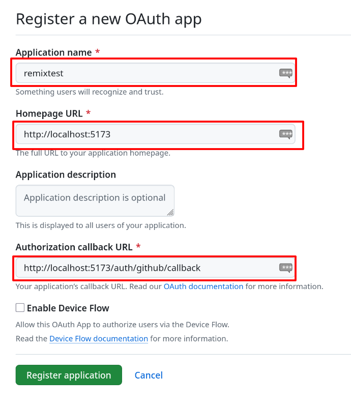
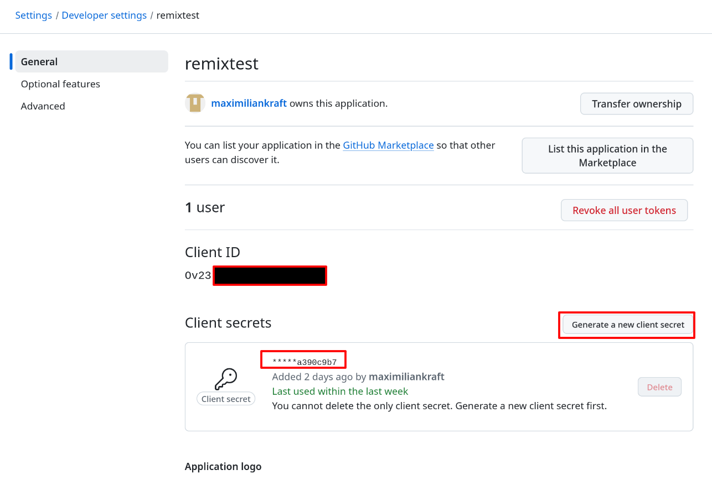

# OAuth 2.0 Authentifizierung mit GitHub in einer Remix-Anwendung

## Einführung in OAuth 2.0

OAuth 2.0 ist ein offener Standard für Authentifizierungs- und Autorisierungsprozesse, der es Diensten von Drittanbietern ermöglicht, auf Ressourcen eines Benutzers zuzugreifen, ohne dessen Zugangsdaten direkt zu verwenden. Dieser Prozess wird durch ein Token-System realisiert, das temporären Zugriff auf bestimmte Ressourcen gewährt.

Der OAuth 2.0 Prozess ist in [RFC 6749](https://datatracker.ietf.org/doc/html/rfc6749) standardisiert und umfasst vier Rollen:

1. **Resource Owner**: Der Benutzer, der Zugriff auf sein Konto gewähren kann
2. **Client**: Die Anwendung, die Zugriff auf das Konto des Benutzers anfordert
3. **Authorization Server**: Der Server, der Zugriffstoken ausstellt
4. **Resource Server**: Der Server, der die geschützten Ressourcen hostet

### Der OAuth 2.0 Autorisierungsablauf mit GitHub

Der OAuth 2.0 Ablauf, speziell für die GitHub-Authentifizierung, läuft folgendermaßen ab:

1. **Autorisierungsanfrage**: Die Anwendung leitet den Benutzer zur GitHub-Autorisierungsseite weiter
2. **Benutzerautorisierung**: Der Benutzer genehmigt die Zugriffsanfrage
3. **Autorisierungscode**: GitHub sendet einen temporären Code an die Anwendung zurück
4. **Tokenanfrage**: Die Anwendung tauscht diesen Code gegen ein Zugriffstoken aus
5. **Ressourcenzugriff**: Mit diesem Token kann die Anwendung auf die API und Ressourcen zugreifen

> [Quelle: Authorizing OAuth apps | Web Application Flow](https://docs.github.com/en/apps/oauth-apps/building-oauth-apps/authorizing-oauth-apps#web-application-flow)

## Einrichtung einer GitHub OAuth-App

Um OAuth mit GitHub zu verwenden, muss eine OAuth-App in den GitHub-Entwicklereinstellungen registriert werden.

### Schritt 1: Erstellen einer neuen OAuth-App in GitHub

1. Melde dich bei [GitHub](https://github.com/) an
2. Navigiere zu den [GitHub Developer Settings](https://github.com/settings/developers)
3. Wähle "OAuth Apps" und klicke auf "New OAuth App"

<!-- SCREENSHOT: GitHub Developer Settings Seite mit hervorgehobenem "New OAuth App" Button -->


### Schritt 2: Konfiguration der OAuth-App

Fülle folgende Felder aus:

- **Application name**: Ein aussagekräftiger Name für deine App (z.B. "Remix GitHub Login")
- **Homepage URL**: Die Basis-URL deiner Anwendung (z.B. "http://localhost:5173")
- **Application description**: (Optional) Eine kurze Beschreibung deiner Anwendung
- **Authorization callback URL**: Die URL, an die GitHub nach der Authentifizierung weiterleitet (z.B. "http://localhost:5173/auth/github/callback")

<!-- SCREENSHOT: Formular zum Ausfüllen der OAuth-App Details mit den oben genannten Feldern -->


### Schritt 3: Client ID und Client Secret

Nach dem Erstellen der App erhältst du zwei wichtige Credentials:

- **Client ID**: Öffentlicher Identifikator für deine App
- **Client Secret**: Geheimer Schlüssel, der sicher aufbewahrt werden muss

Diese Credentials werden in deiner Anwendung benötigt, um den OAuth-Prozess zu durchlaufen.

<!-- SCREENSHOT: Seite mit Client ID und Client Secret (mit teilweise verdecktem Secret) -->



## Umsetzung in einer Remix-Anwendung

In diesem Projekt wurde der OAuth 2.0 Authentifizierungsfluss mit GitHub direkt implementiert, ohne die Passport.js-Middleware zu verwenden. Dies bietet mehr Kontrolle über den Authentifizierungsprozess und erleichtert das Verständnis der einzelnen Schritte.

### Technische Struktur der OAuth-Implementation

1. **GitHub Strategie (`app/auth/github.ts`):**
  - Definition des GitHub-Profil-Typs
  - Methoden zum Generieren der Autorisierungs-URL
  - Funktionen zum Austausch des Codes gegen ein Token
  - Abrufen des Benutzerprofils mit dem erhaltenen Token

2. **Authentifizierungsinitiierung (`app/routes/auth.github.tsx`):**
  - Leitet dich zur GitHub-Autorisierungsseite weiter
  - Verarbeitet sowohl direkte Link-Aufrufe als auch Formular-Übermittlungen

3. **Callback-Verarbeitung (`app/routes/auth.github.callback.tsx`):**
  - Empfängt den Autorisierungscode von GitHub
  - Tauscht ihn gegen ein Zugriffstoken aus
  - Ruft das Benutzerprofil ab
  - Speichert die Benutzerdaten in der Session
  - Leitet nach erfolgreicher Authentifizierung weiter

4. **Session-Verwaltung (`app/session.server.ts`):**
  - Erstellt einen Cookie-basierten Session-Speicher
  - Bietet Funktionen zum Abrufen, Speichern und Löschen von Sitzungsdaten

5. **Login-Seite (`app/routes/login.tsx`):**
  - Zeigt den "Login with GitHub"-Button an
  - Verarbeitet und zeigt Fehlermeldungen bei fehlgeschlagener Authentifizierung

6. **Startseite (`app/routes/_index.tsx`):**
  - Prüft, ob ein Benutzer angemeldet ist
  - Zeigt Benutzerinformationen an, wenn angemeldet
  - Bietet eine Abmelde-Funktion

## Code-Beispiel: Einleitung des OAuth-Flows

```typescript
// app/auth/github.ts (Auszug)
export const githubStrategy = {
  options: {
   clientID: process.env.GITHUB_CLIENT_ID!,
   clientSecret: process.env.GITHUB_CLIENT_SECRET!,
   callbackURL: "http://localhost:5173/auth/github/callback",
  },

  getAuthorizationURL(scopes: string[] = ["user:email"]) {
   const url = new URL("https://github.com/login/oauth/authorize");
   url.searchParams.set("client_id", this.options.clientID);
   url.searchParams.set("redirect_uri", this.options.callbackURL);
   url.searchParams.set("scope", scopes.join(" "));
   return url.toString();
  },
  
  // Weitere Methoden...
};
```

## Code-Beispiel: Verarbeitung des Callback

```typescript
// app/routes/auth.github.callback.tsx (Auszug)
export let loader: LoaderFunction = async ({ request }) => {
  try {
   const url = new URL(request.url);
   const code = url.searchParams.get("code");
   
   if (!code) {
    return redirect("/login?error=github-auth-failed-no-code");
   }
   
   // Code gegen Access Token austauschen
   const accessToken = await githubStrategy.getAccessToken(code);
   
   // Benutzerprofil abrufen
   const profile = await githubStrategy.getUserProfile(accessToken);
   
   // In Session speichern
   const session = await getSession(request.headers.get("Cookie"));
   session.set("user", {
    id: profile.id,
    displayName: profile.displayName || profile.username,
    // Weitere Benutzerdaten...
   });
   
   return redirect("/", {
    headers: {
      "Set-Cookie": await commitSession(session)
    }
   });
  } catch (error) {
   return redirect("/login?error=github-auth-failed");
  }
};
```

## Aufgabe: GitHub OAuth in einer Remix-Anwendung

In dieser Aufgabe erstellst du eine Remix-Anwendung mit GitHub-Authentifizierung. Befolge die folgenden Schritte, um diese Funktionalität zu implementieren:

### 1. Neue Remix-Anwendung erstellen

Erstelle eine neue Remix-Anwendung mit folgendem Befehl:

```bash
npx create-remix@latest
```

Folge den Anweisungen im Terminal, um die Anwendung zu konfigurieren.

### 2. GitHub OAuth-App einrichten

Erstelle eine OAuth-App in deinen GitHub-Entwicklereinstellungen, wie oben beschrieben:
- **Application name**: `Remix GitHub Login`
- **Homepage URL**: `http://localhost:5173`
- **Authorization callback URL**: `http://localhost:5173/auth/github/callback`

Notiere dir die erhaltene Client ID und das Client Secret.

### 3. OAuth-Implementierung

Implementiere die GitHub-Authentifizierung basierend auf der in diesem Projekt vorgestellten Struktur:

1. Erstelle die GitHub-Strategie in `app/auth/github.ts`
2. Richte die Session-Verwaltung in `app/session.server.ts` ein
3. Erstelle die Authentifizierungsroute in `app/routes/auth.github.tsx`
4. Implementiere die Callback-Verarbeitung in `app/routes/auth.github.callback.tsx`
5. Gestalte die Login-Seite in `app/routes/login.tsx`
6. Passe die Startseite in `app/routes/_index.tsx` an, um den Benutzerstatus anzuzeigen

### 4. Umgebungsvariablen konfigurieren

Erstelle eine `.env`-Datei und füge deine GitHub-Credentials hinzu:

```
GITHUB_CLIENT_ID=Deine-Client-ID
GITHUB_CLIENT_SECRET=Dein-Client-Secret
```

### 5. Anwendung testen

Starte die Anwendung mit:

```bash
npm run dev
```

Öffne [http://localhost:5173](http://localhost:5173) und teste den "Login with GitHub"-Button.

## Zusätzliche Ressourcen

- [OAuth 2.0 Spezifikation (RFC 6749)](https://datatracker.ietf.org/doc/html/rfc6749)
- [GitHub OAuth Dokumentation](https://docs.github.com/en/developers/apps/building-oauth-apps)
- [Remix Dokumentation](https://remix.run/docs/en/main)
- [GitHub REST API](https://docs.github.com/en/rest)
- [Authorizing OAuth apps | Web Application Flow](https://docs.github.com/en/apps/oauth-apps/building-oauth-apps/authorizing-oauth-apps#web-application-flow)

